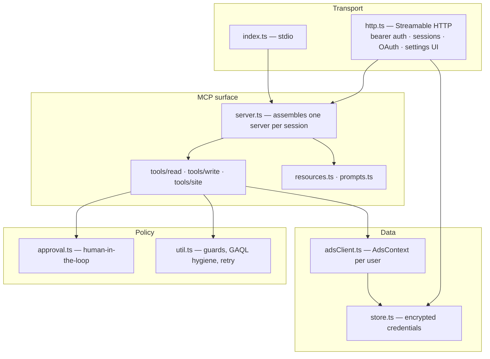
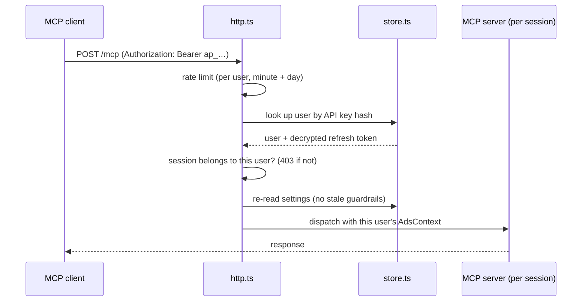
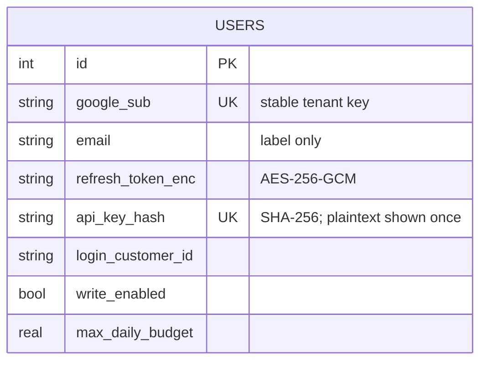

<!-- SPDX-License-Identifier: AGPL-3.0-only -->
# Architecture

This document explains how AdsPilot is put together and, more importantly, *why*.
Most of the design exists to answer one question: how do you give an autonomous agent
write access to a system that spends money, without the agent being the one who decides
whether a human said yes?

## Design goals

1. **A human is in the loop for anything that increases spend** — and the server, not
   the agent, is what makes that true.
2. **Ambiguity is not permission.** When the server can't establish that an action is
   safe, it asks instead of assuming.
3. **The server is deterministic and testable.** Creative work (which keywords, what ad
   copy) belongs to the client-side model. The server extracts facts, enforces rules,
   and executes.
4. **One codebase, two deployment shapes.** A local single-user tool and a multi-tenant
   service should not be two products.

### Non-goals

- Generating ad copy server-side. The client's model already does this well, and moving
  it into the server would make behaviour non-deterministic and untestable.
- Being a general Google Ads API wrapper. Tools are chosen for a workflow, not for API
  surface coverage.
- Multi-platform (Meta, TikTok) before the Google surface is genuinely good.

## Layers



The important structural decision is that **tools never reach global state**. Every tool
receives a `ContextProvider` — a function returning the `AdsContext` for the caller.
In stdio mode that's a singleton built from `.env`; in hosted mode it's the session's
user, re-read from the database on every request.

This one indirection is what makes multi-tenancy safe *and* makes the test suite
possible: tests inject a fake context and drive the real server over a real MCP
transport.

## Request lifecycle

### Local (stdio)

```
MCP client ⇄ stdio ⇄ server ⇄ AdsContext(.env) ⇄ Google Ads API
```

No database, no sessions, no auth layer. The user owns the machine and the credentials.

### Hosted (HTTP)



Four properties fall out of this ordering:

- **Session hijacking is structurally blocked.** A session ID is bound to a user at
  creation; a request carrying someone else's session gets `403`, never a data leak.
- **Guardrails can't go stale.** Settings are re-read per request, so revoking write
  access takes effect on the *next call* of an already-open session.
- **The shared quota is protected.** Every hosted user shares one developer token, and
  Google's daily operation quota is per *token*, not per account — so a per-user rate
  limiter isn't a nicety, it's what stops one user from taking down everyone else.
- **Unknown sessions are rejected, not resurrected.** An unrecognised session ID returns
  `404` rather than silently constructing a new server, which would let random IDs
  allocate unbounded objects.

## The safety architecture

This is the part worth reading closely.

### Where approval happens

`approval.ts` exposes a single function used by every spend-increasing path. Its
behaviour depends on one thing: whether the connected client advertises MCP
**elicitation** support.

| Client | Who decides | Agent's `confirm` |
|---|---|---|
| Supports elicitation | The human, through the protocol | **Ignored** |
| Does not support it | The agent asserts it asked | Honoured (compatibility) |

The first row is the design's whole point. Without it, "did you ask the user?" is a
question only the agent can answer, and a careless or adversarial agent answers yes.

Failure modes all resolve to *not executing*: declined, cancelled, schema mismatch,
client error, and timeout (10 minutes — the SDK's 60-second default is far too short
for a human who switches tabs to check something).

The second row is a real, documented limitation rather than a hidden one; see
[SECURITY.md](SECURITY.md).

### What counts as "increases spend"

| Action | Approval | Reasoning |
|---|---|---|
| Enable a campaign | yes | starts serving |
| Raise a daily budget | yes | directly increases exposure |
| Add ad / positive keyword to a **live** campaign | yes | serves immediately; same weight as enabling |
| Add ad / keyword to a **paused** campaign | no | nothing serves; this is the drafting flow |
| Lower a budget, pause, add negative keywords | no | reduces spend |

Getting this distinction right matters as much as the gate itself. A system that asks
for approval on everything trains users to click through, and one that asks on nothing
is unsafe. The rule is: **approval tracks spend increase, not write-ness.**

### Fail-closed by construction

Several guards were originally written to assume safety when the picture was unclear.
That is now inverted, deliberately:

- If the campaign-status query returns no rows, or the status field is missing, or has
  an unexpected type — treat it as live and ask.
- If the existing budget can't be read, we can't know whether the new value is an
  increase — ask.
- If the approval prompt can't be delivered — don't execute.

The corresponding regression tests live in `test/failclosed.test.ts`, because a guard
that silently stops guarding is worse than no guard: the promise remains in the docs.

### Guardrails the agent cannot touch

Budget ceiling and write permission are per-user, readable through
`adspilot://accounts/{id}/limits`, and writable **only** from an authenticated browser
session at `/settings`. The API key deliberately does not open that endpoint — the agent
holds that key, so a key-protected settings page would be no protection at all.

## Multi-tenancy and credentials



Three decisions are load-bearing:

**The tenant key is Google's `sub`, not email.** Email changes, and can be reassigned in
Workspace. Worse, an earlier version fell back to a shared row when identity couldn't be
resolved — which let one user invalidate another's credentials. Identity that can't be
established now fails the connection outright.

**Refresh tokens are encrypted at rest** with AES-256-GCM. The key comes from
`ADSPILOT_MASTER_KEY`, trimmed first, and exactly two shapes are accepted: **exactly 64 hex
characters**, used directly as the 32-byte key, or a **non-hex passphrase** of at least 32
characters, stretched with scrypt because a human-chosen passphrase run through a plain hash
is weak. A hex-only value of any other length — a machine key copied one character short, or
an `openssl rand -hex 16` that produces 32 hex characters — is **refused at startup** instead
of being treated as a passphrase. That silent fallback derived a *different* key: nothing in
the database decrypted while the process still reported itself healthy, which is the exact
shape of failure this codebase refuses. Existing installs running such a key: see the upgrade
note in `deploy/README.md`.

**API keys are stored as hashes only.** The plaintext is shown once, at connection time.

SQLite runs in WAL mode with a busy timeout — the default of zero turns two simultaneous
requests into a hard `SQLITE_BUSY` error rather than a short wait.

## Working with the Google Ads API

A few behaviours of the client library and API shaped the code:

**Queries must be single-line.** The library parses the query text client-side to decide
which fields land on result rows, and a bare newline breaks the last field in the SELECT
list — silently, producing `null`. Every read path normalises whitespace first, while
preserving the contents of string literals (collapsing those would change what a query
matches).

**Every query gets a LIMIT.** Without one the library buffers all pages into memory; in
a shared process that is a denial of service. User-supplied limits above the ceiling are
clamped rather than trusted.

**Mutations are not retried on network errors** — a request that may have succeeded must
not be replayed, or you get duplicate campaigns. The single exception is
`CONCURRENT_MODIFICATION`, where Google explicitly rejects the write and asks you to
retry.

**Money is integers.** All amounts convert through `Math.round(x * 1e6)`; floating-point
multiplication produces values Google's int64 fields reject.

## Fetching untrusted websites

`analyze_site` retrieves arbitrary URLs on the server's behalf, which makes it the most
exposed surface in the system.

- **SSRF:** private ranges, loopback, link-local and cloud-metadata addresses are
  rejected by hostname *and* by every resolved IP, so a public name pointing at
  `169.254.169.254` doesn't get through. Redirects are followed manually and each hop is
  re-validated **before** the request. Ports below 1024 other than 80/443 are refused.
- **Algorithmic complexity:** parsing uses linear `indexOf` scanning rather than regular
  expressions with backtracking. The regex-based version was quadratic — 80 KB of a
  pathological payload took two seconds, and at the 1.5 MB body cap a single request
  would have frozen the whole process for minutes.
- **Prompt injection:** extracted content is returned inside a delimited untrusted-data
  block, with forged closing tags stripped and an explicit instruction to the agent not
  to act on anything inside it.
- **Turkish text:** case-insensitive matching uses ASCII-only lowering, because
  `toLowerCase()` expands `İ` into two code units and shifts every index after it.

## Testing strategy

| Layer | Approach |
|---|---|
| Pure logic | Unit tests with injected clocks and fixtures |
| Tools | Real MCP client/server over `InMemoryTransport`, fake `AdsContext` |
| HTTP | A real server process, real requests, fake Google credentials |
| Behaviour | Adversarial scenarios that pursue a bad outcome by every known route |
| Promises | Each documented guarantee mapped to an executing test |

Guards are validated by **mutation testing**: the guard is deliberately broken and the
suite must go red. This caught two things a green suite would not have — a fix that was
described in a commit message but never applied to the code, and a test that asserted on
a value the code path never produced.

## Known limits

Stated plainly, because a limitation you know about is a design decision and one you
don't is a bug:

- **The budget ceiling is per campaign, not per account.** Ten campaigns at the ceiling
  is ten times the ceiling. Documented in the `limits` resource.
- **Clients without elicitation fall back to agent-asserted confirmation.** Keeping
  backward compatibility costs this; prefer clients that support elicitation.
- **Sessions and rate-limit counters live in process memory.** The hosted service must
  run as a single instance. Horizontal scaling requires moving both to shared storage.
- **The developer token's quota is shared across all hosted users** — the ceiling on how
  many users one deployment can serve.
- **Date ranges use the server's local time**, not each account's configured time zone,
  so a report window can be off by a day near midnight.

## Repository layout

```
src/
  index.ts        stdio entry point
  http.ts         hosted entry point: auth, sessions, OAuth, settings UI
  server.ts       assembles tools + resources + prompts for one session
  approval.ts     human-in-the-loop gate
  adsClient.ts    AdsContext: per-user credentials, retry policy, account tree
  store.ts        SQLite: encrypted tokens, API keys, per-user settings
  util.ts         guards, GAQL hygiene, error formatting, retry primitives
  rateLimit.ts    per-user sliding-window limiter
  siteExtract.ts  linear-time HTML extraction + SSRF predicates
  config.ts       environment parsing that fails safe
  tools/          read · write · site
  resources.ts    browsable data
  prompts.ts      slash-command workflows
deploy/           systemd, nginx, and a step-by-step VPS guide
scripts/          OAuth helper, and the live smoke test
test/             offline suite + fake-API harness
```
