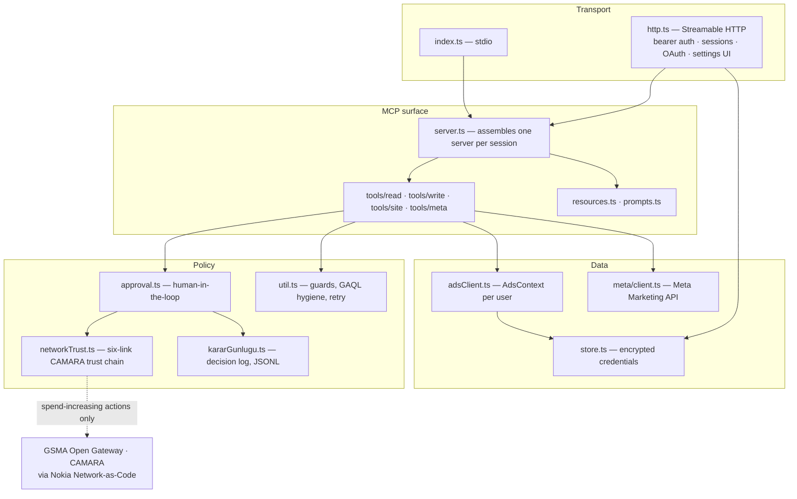
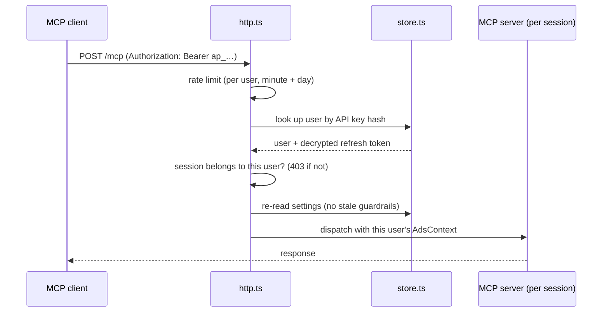
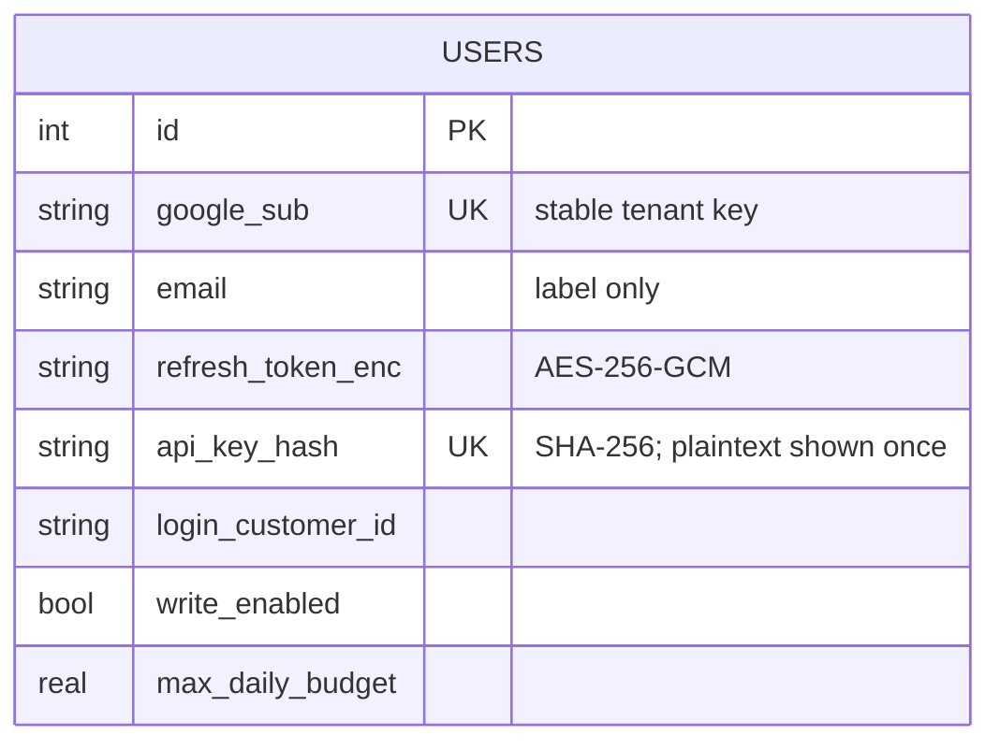

<!-- SPDX-License-Identifier: AGPL-3.0-only -->
# Architecture

This document explains how Aegis is put together and, more importantly, *why*.
Most of the design exists to answer one question: how do you give an autonomous agent
write access to a system that spends money, without the agent being the one who decides
whether a human said yes?

## Design goals

1. **A human is in the loop for anything that increases spend** — and the server, not
   the agent, is what makes that true.
2. **Ambiguity is not permission.** When the server can't establish that an action is
   safe, it asks instead of assuming.
3. **The server is deterministic and testable.** Creative work (which keywords, what ad
   copy) belongs to the client-side model. The server extracts facts, enforces rules,
   and executes.
4. **One codebase, two deployment shapes.** A local single-user tool and a multi-tenant
   service should not be two products.

### Non-goals

- Generating ad copy server-side. The client's model already does this well, and moving
  it into the server would make behaviour non-deterministic and untestable.
- Being a general Google Ads API wrapper. Tools are chosen for a workflow, not for API
  surface coverage.
- Multi-platform (Meta, TikTok) before the Google surface is genuinely good.

## Layers



The important structural decision is that **tools never reach global state**. Every tool
receives a `ContextProvider` — a function returning the `AdsContext` for the caller.
In stdio mode that's a singleton built from `.env`; in hosted mode it's the session's
user, re-read from the database on every request.

This one indirection is what makes multi-tenancy safe *and* makes the test suite
possible: tests inject a fake context and drive the real server over a real MCP
transport.

The Policy layer has an ordering of its own, and it carries most of the design: a
spend-increasing tool call reaches `approval.ts`, which consults `networkTrust.ts` **before**
it asks any human anything, and records the network's verdict in `kararGunlugu.ts` whichever
way that verdict went. The safety architecture below is largely the story of that ordering.

## Request lifecycle

### Local (stdio)

```
MCP client ⇄ stdio ⇄ server ⇄ AdsContext(.env) ⇄ Google Ads API
```

No database, no sessions, no auth layer. The user owns the machine and the credentials.

### Hosted (HTTP)



Four properties fall out of this ordering:

- **Session hijacking is structurally blocked.** A session ID is bound to a user at
  creation; a request carrying someone else's session gets `403`, never a data leak.
- **Guardrails can't go stale.** Settings are re-read per request, so revoking write
  access takes effect on the *next call* of an already-open session.
- **The shared quota is protected.** Every hosted user shares one developer token, and
  Google's daily operation quota is per *token*, not per account — so a per-user rate
  limiter isn't a nicety, it's what stops one user from taking down everyone else.
- **Unknown sessions are rejected, not resurrected.** An unrecognised session ID returns
  `404` rather than silently constructing a new server, which would let random IDs
  allocate unbounded objects.

## The safety architecture

This is the part worth reading closely.

### Where approval happens

`approval.ts` exposes a single function used by every spend-increasing path. Its
behaviour depends on one thing: whether the connected client advertises MCP
**elicitation** support.

| Client | Who decides | Agent's `confirm` |
|---|---|---|
| Supports elicitation | The human, through the protocol | **Ignored** |
| Does not support it | The agent asserts it asked | Honoured (compatibility) |

The first row is the design's whole point. Without it, "did you ask the user?" is a
question only the agent can answer, and a careless or adversarial agent answers yes.

Failure modes all resolve to *not executing*: declined, cancelled, schema mismatch,
client error, and timeout (10 minutes — the SDK's 60-second default is far too short
for a human who switches tabs to check something).

The second row is a real, documented limitation rather than a hidden one; see
[SECURITY.md](SECURITY.md).

### What counts as "increases spend"

| Action | Approval | Risk tier | Reasoning |
|---|---|---|---|
| Enable a campaign | yes | `high` | starts serving |
| Raise a daily budget | yes | `medium` | directly increases exposure |
| Add ad / positive keyword to a **live** campaign | yes | `high` | serves immediately; same weight as enabling |
| Add ad / keyword to a **paused** campaign | no | — | nothing serves; this is the drafting flow |
| Lower a budget, pause, add negative keywords | no | — | reduces spend |

Getting this distinction right matters as much as the gate itself. A system that asks
for approval on everything trains users to click through, and one that asks on nothing
is unsafe. The rule is: **approval tracks spend increase, not write-ness.**

The risk tier is what the network gate below reads. Meta's two write paths carry the same
two tiers as Google's, deliberately: the gate's central claim is that "ask the network before
you ask a human" is a property of any path that moves money, not a Google Ads feature — and a
claim like that is cheap until a second spend domain sits behind the same gate.

### Fail-closed by construction

Several guards were originally written to assume safety when the picture was unclear.
That is now inverted, deliberately:

- If the campaign-status query returns no rows, or the status field is missing, or has
  an unexpected type — treat it as live and ask.
- If the existing budget can't be read, we can't know whether the new value is an
  increase — ask.
- If the approval prompt can't be delivered — don't execute.

The corresponding regression tests live in `test/failclosed.test.ts`, because a guard
that silently stops guarding is worse than no guard: the promise remains in the docs.

### The network trust gate

The same rule, at the point where it is hardest to keep. Elicitation proves that *a* human
clicked approve; it cannot prove *which* human. A stolen session answers the prompt exactly as
convincingly as its owner does. The mobile network, though, holds evidence no application
layer can forge — the operator knows whether the owner's SIM was swapped last night, which is
the signature move of account takeover. So before a spend-increasing action reaches a prompt,
`networkTrust.ts` asks the operator about the approver's line over the GSMA Open Gateway /
CAMARA APIs, reached through the Nokia Network-as-Code platform.

The ordering is the point. **The network is asked before the prompt is rendered**, and before
the `confirm` fallback is consulted as well — gating only the elicitation branch would let a
stolen session drop to `confirm: true` and walk around the anchor. When the gate refuses, no
human is asked at all, because the person who would answer may be the attacker who took the
line.

#### The six-link chain, and what each link sees

Each link answers a question the others cannot, and each keeps **its own field** in the trace
and in the audit record. Two links are never flattened into one, because "a real SIM Swap
query plus a simulated second link" and "all of it simulated" are different amounts of
confidence, and preserving that difference is the audit trail's whole job.

| # | CAMARA signal | Trace field | Log field | Question it answers | Channel today |
|---|---|---|---|---|---|
| 1 | SIM Swap | `simSwap` | `simSwapKanali` | was the line taken over recently? | real query, or the demo simulation |
| 2 | Number Verification | `nv` | `nvKanali` | is the approval coming from the owner's own device? | **simulation only, structurally** |
| 3 | Device Reachability | `reach` | `reachKanali` | is the line reachable on the network right now? | real query, opt-in |
| 4 | Device Roaming | `loc` | `locKanali` | is the line outside the expected country? | real query, needs an expected country |
| 5 | Device Swap | `devSwap` | `devSwapKanali` | did the line move to a new handset? | real query, opt-in |
| 6 | Call Forwarding | `callFwd` | `callFwdKanali` | is unconditional forwarding active — the OTP intercept? | real query, opt-in |

Link 2 is simulated and stays that way here: CAMARA Number Verification is a device-side OIDC
flow bound to the device's own mobile-data connection, so a back-end server cannot run it
whatever credential it holds. That is an architectural verdict, not a to-do, and it is
enforced rather than promised — the link's trace type has no "real" value in it, so no later
edit can quietly claim one. Link 4 answers the country question through Device Roaming rather
than Location Verification because the SDK's `Area` type carries no centre or radius fields at
all; inventing that schema with `as any` would buy a `400` on every call and turn the link into
a permanent refusal. Its scope is therefore country-level, which is what the gate promises
today.

`ZINCIR_HALKALARI` in `networkTrust.ts` is the single registry behind that table. Each row
names the link's trace field, its decision-log field, its own look-back window field, the
environment variables it reads, the settings that must enter the hosted context cache key, and
the distinctive phrases its refusal text really contains. It exists because one mistake
repeated four rounds running: a link was added to the gate and a downstream consumer was not,
silently every time — the log lied, an enabled link was served from the cache as disabled, and
a gate refusal was reported downstream as an ordinary server error. The registry is not a
behaviour switch; adding a row does not make a link run. It declares a link's obligations so
that `test/zincirButunlugu.test.ts` can hold every consumer to them. Where a link has been
verified against a live endpoint the row also carries the date, which puts the most expensive
claim in the project — "this one really ran" — in code the tests can read rather than in prose;
the record itself is in [docs/CAMARA.md](docs/CAMARA.md).

#### The risk tier decides which links run

| Tier | Links that run |
|---|---|
| `medium` — budget increases | `simSwap` |
| `high` — go-live, and changes to a serving campaign | `simSwap` · `nv` · `reach` · `loc` · `devSwap` · `callFwd` |

`RISK_HALKA_ESLEMESI` is the single source of that mapping. It used to be five scattered
`if (risk !== "high") return` lines, which meant answering "which links run for this action?"
took reading five functions, and changing one of them was a policy change nobody could see.
The tier also narrows the SIM-swap look-back: `medium` asks about the last 24 hours at most,
`high` uses the configured window (`AEGIS_SIMSWAP_WINDOW_HOURS`, 72 hours by default).

Every live link adds a CAMARA round trip to every high-tier approval, and one more way to
refuse a legitimate spend — so **no link is on by default**. Holding a Network-as-Code token
(`AEGIS_NAC_TOKEN`) switches on link 1 and nothing else; links 3, 5 and 6 each need their
own opt-in variable (`AEGIS_REACH_CHECK`, `AEGIS_DEVICESWAP_CHECK`, `AEGIS_CALLFWD_CHECK`)
and link 4 needs an expected country (`AEGIS_EXPECTED_COUNTRY`) to compare against, because
a default country would answer "clean" forever. A link that is configured but switched off records `kapali` in the
trail: "I did not ask" must never read like "I asked and it passed".

#### What the gate does when it cannot know

| Situation | Outcome |
|---|---|
| Not configured at all — no token | pass-through, and the evidence line says the gate was off |
| Token set, approver number missing (`AEGIS_APPROVER_PHONE`) | refuse: the check the operator asked for cannot run |
| A reply arrives but cannot be read | refuse: `undefined` is not `false` |
| The endpoint throws, or is unreachable | refuse: a trust anchor that cannot answer is not an anchor |
| An expected country that is not a two-letter code | refuse: the operator asked for the link and gave a value nobody can read |
| A risk-tagged action whose config never reached the gate | refuse: skipping the check there would be fail-open by omission |

The third row is the one that keeps having to be re-won. Every link's channel returns
`boolean | undefined` on purpose, and a type guarantee is not a runtime guarantee: an
unreadable `swapped` field is not "the SIM did not change". The inverse matters just as much —
an unreadable answer is not an accusation either. The sentence shown to the approver is derived
from the *reason*, not from the link, because a version that derived it from the link told the
approver that their SIM had changed, their device was unreachable, their line was abroad or
their handset was new — on four separate links — when the truth was only that the query could
not be answered.

#### The surety rule

Step-up (below) can turn a refusal into an escalation, and an escalation is only as good as the
links carrying it. `KEFIL_ESLEMESI` states the rule: **a link may vouch for a degraded signal
only if it could genuinely have contradicted it.** Reachability appears in none of its rows —
it is a liveness signal, not an identity one. The attacker's handset holding the swapped SIM
answers the network just as readily, so "the device is on" disproves nothing. It makes a useful
gate and a worthless witness. That distinction was measured, not theorised: a real, detected SIM
change once passed the gate vouched for by the reachability link alone.

Two conditions narrow it further, both learned the same way:

- **A witness must have observed something.** The roaming link comes back clean when the network
  reports no country at all; a link that measured nothing can contradict nothing
  (`HalkaSonuc.gozlemsiz`). Measured: a real `swapped: true` alongside an empty country list came
  out as an escalation vouched for by the location link.
- **A silent link's witnesses are derived, not hand-written.** `ag-yanitsiz` is the one reason
  that does not name the link that produced it, so `YANITSIZ_KEFIL_ESLEMESI` breaks it down per
  link — and it is *computed* from `KEFIL_ESLEMESI` rather than copied, because one doctrine
  written twice drifts in exactly one direction: the voucher set widens. A link whose *detected*
  signal cannot be escalated cannot have its *silence* escalated either, which is why call
  forwarding maps to the empty set. Before that, a check answering `501` — which the SDK
  documents as allowed — escalated every high-tier approval, vouched for by three links that
  cannot see forwarding at all: forwarding known to be active was refused while forwarding of
  unknown state was waved through, the unknown treated more leniently than the known.

Simulated links never vouch for anything either. Otherwise a single environment value would be
the cheapest way past the gate.

#### Step-up verification

A hard fail-closed gate has a cost the design has to own, and Nokia's review of the chain named
it: legitimate SIM changes, new phones and travel happen every day, and each of them refuses a
real user with no way forward. `AEGIS_STEPUP` is the answer — **off by default**, because an
escalation is a loosening and a loosening has to be chosen by the operator rather than inherited.

With it on, a degraded signal whose reason is in `KADEME_UYGUN` is held pending instead of
returned, the remaining links still run, and if a real, observing, contradiction-capable link
comes back clean the refusal becomes an escalation: the action is bound to a stronger human
question instead of being dropped.

| Step-up reason | The ordinary situation behind it |
|---|---|
| `sim-degisti` | the SIM was replaced |
| `cihaz-degisti` | the phone was replaced |
| `cihaz-erisilemez` | the phone is off, or out of coverage |
| `konum-beklenmedik` | the approver is travelling |
| `ag-yanitsiz` | the check could not be answered |

What the escalation is paid for with, exactly: a prompt whose header names the degraded signal,
a changed question ("do you approve *despite* the degraded network signal?"), a refusal on any
client that cannot show a prompt at all, and a refusal whenever no capable witness came back
clean. It does **not** lower any spending ceiling. Four comments in this codebase used to
promise that it did, and nothing anywhere implemented it; the promise was deleted rather than
softened, because a compensating control that does not exist makes the gate read stronger than
it is.

Two reasons stay outside the eligible set deliberately. `cagri-yonlendirme-acik`, because
escalating while unconditional call forwarding is active sends the stronger verification down
the very channel the attacker has taken over — it would do the attacker's work. And
`nv-uyusmadi`, because a number mismatch is not an unknown but a stated contradiction.
Configuration faults are excluded on a different ground: a stronger check on the user does not
fix the operator's misconfiguration, it papers over it.

#### What the gate is allowed to say

- The approver's number leaves only through `maskele()` — in prompts, in refusals and in the
  log alike — and the log independently refuses to write a number that does not look masked.
- Refusal reasons are a fixed vocabulary (`RetNedeni`), never upstream text. CAMARA 4xx bodies
  echo the offending phone number verbatim and the SDK builds `error.message` out of the body,
  so inlining it would hand the agent the exact secret the masking protects. Details go to the
  operator's stderr with the number redacted format-independently: `+90 555 111 22 33`,
  `%2B905551112233` and `0090 555 111 22 33` are all the same number to the redactor.
- The gate's evidence lines — masked number, look-back window, expected country — go to the
  **human's** channel only. They used to ride back to the agent with every refusal, which handed
  anyone probing the gate its exact dimensions.
- Raw upstream values never leave at all: the country list the operator reports enters neither
  the evidence, nor the refusal text, nor the trace. Only the derived "expected / unexpected"
  verdict does.

#### The decision log

The gate tells the agent that it refused; the account owner needs to be able to ask, a month
later, how often and under which window. `kararGunlugu.ts` appends one JSONL record per
risk-tagged decision — **passes as well as refusals**, because a log of refusals alone cannot
distinguish "asked and passed" from "never asked".

| `karar` value | Meaning |
|---|---|
| `gecti` | the chain ran and no signal was degraded |
| `kademeli` | a signal was degraded, and the action passed by escalation |
| `ret` | refused |
| `kapali` | no query ran at all — the gate was off |

`kademeli` is a separate verdict rather than a shade of `gecti` on purpose: collapse the two and
the question "how often did we loosen?" stops being answerable after the fact. Four further
properties are load-bearing:

- **The record is derived from the trace, never from text.** Channel, window, number and reason
  used to be recovered by sniffing the refusal strings, and because two links' words merged into
  one string, the log could lie — a real CAMARA query recorded as a simulation.
- **The log is an observation, not a gate.** A write failure prints one line to stderr and the
  approval flow continues unchanged; the opposite would turn an audit tool into a fresh way for
  a mistyped path to block legitimate spending.
- **The amount is measured, not guessed.** The daily amount at stake is recorded only where the
  call site actually managed to read it. Writing `0` would record "I do not know" as "no money".
- **It has a ceiling.** At 16 MiB the file rolls over to `<path>.1`. An unbounded audit file is a
  way to fill a disk with requests that would have been refused anyway — and on a full disk the
  trail stops silently, since a write failure never interrupts the flow.

The log stays off unless `AEGIS_DECISION_LOG` names a file.

### Guardrails the agent cannot touch

Budget ceiling and write permission are per-user, readable through
`aegis://accounts/{id}/limits`, and writable **only** from an authenticated browser
session at `/settings`. The API key deliberately does not open that endpoint — the agent
holds that key, so a key-protected settings page would be no protection at all.

## Multi-tenancy and credentials



Three decisions are load-bearing:

**The tenant key is Google's `sub`, not email.** Email changes, and can be reassigned in
Workspace. Worse, an earlier version fell back to a shared row when identity couldn't be
resolved — which let one user invalidate another's credentials. Identity that can't be
established now fails the connection outright.

**Refresh tokens are encrypted at rest** with AES-256-GCM. The key comes from
`AEGIS_MASTER_KEY`, trimmed first, and exactly two shapes are accepted: **exactly 64 hex
characters**, used directly as the 32-byte key, or a **non-hex passphrase** of at least 32
characters, stretched with scrypt because a human-chosen passphrase run through a plain hash
is weak. A hex-only value of any other length — a machine key copied one character short, or
an `openssl rand -hex 16` that produces 32 hex characters — is **refused at startup** instead
of being treated as a passphrase. That silent fallback derived a *different* key: nothing in
the database decrypted while the process still reported itself healthy, which is the exact
shape of failure this codebase refuses. Existing installs running such a key: see the upgrade
note in `deploy/README.md`.

**API keys are stored as hashes only.** The plaintext is shown once, at connection time.

SQLite runs in WAL mode with a busy timeout — the default of zero turns two simultaneous
requests into a hard `SQLITE_BUSY` error rather than a short wait.

## Working with the Google Ads API

A few behaviours of the client library and API shaped the code:

**Queries must be single-line.** The library parses the query text client-side to decide
which fields land on result rows, and a bare newline breaks the last field in the SELECT
list — silently, producing `null`. Every read path normalises whitespace first, while
preserving the contents of string literals (collapsing those would change what a query
matches).

**Every query gets a LIMIT.** Without one the library buffers all pages into memory; in
a shared process that is a denial of service. User-supplied limits above the ceiling are
clamped rather than trusted.

**Mutations are not retried on network errors** — a request that may have succeeded must
not be replayed, or you get duplicate campaigns. The single exception is
`CONCURRENT_MODIFICATION`, where Google explicitly rejects the write and asks you to
retry.

**Money is integers.** All amounts convert through `Math.round(x * 1e6)`; floating-point
multiplication produces values Google's int64 fields reject.

## Fetching untrusted websites

`analyze_site` retrieves arbitrary URLs on the server's behalf, which makes it the most
exposed surface in the system.

- **SSRF:** private ranges, loopback, link-local and cloud-metadata addresses are
  rejected by hostname *and* by every resolved IP, so a public name pointing at
  `169.254.169.254` doesn't get through. Redirects are followed manually and each hop is
  re-validated **before** the request. Ports below 1024 other than 80/443 are refused.
- **Algorithmic complexity:** parsing uses linear `indexOf` scanning rather than regular
  expressions with backtracking. The regex-based version was quadratic — 80 KB of a
  pathological payload took two seconds, and at the 1.5 MB body cap a single request
  would have frozen the whole process for minutes.
- **Prompt injection:** extracted content is returned inside a delimited untrusted-data
  block, with forged closing tags stripped and an explicit instruction to the agent not
  to act on anything inside it.
- **Turkish text:** case-insensitive matching uses ASCII-only lowering, because
  `toLowerCase()` expands `İ` into two code units and shifts every index after it.

## Testing strategy

| Layer | Approach |
|---|---|
| Pure logic | Unit tests with injected clocks and fixtures |
| Tools | Real MCP client/server over `InMemoryTransport`, fake `AdsContext` |
| HTTP | A real server process, real requests, fake Google credentials |
| Behaviour | Adversarial scenarios that pursue a bad outcome by every known route |
| Promises | Each documented guarantee mapped to an executing test |
| Documentation | Guards that derive the claim from the code, so prose cannot drift |

The documentation row is not decoration. A sentence that describes a guard is part of the
guard: an operator who trusts a stale sentence configures the wrong thing. So the claims in
this file that can be derived from code are derived from it — the chain table from
`ZINCIR_HALKALARI`, the tier table from `RISK_HALKA_ESLEMESI`, the step-up list from
`KADEME_UYGUN`, the log vocabulary from `KARAR_SONUCLARI`, the repository layout from the
files that actually exist (`test/belgeAgKapisi.test.ts`). Those guards fail in both
directions, which is the only kind worth having: editing the prose to say something the code
does not turns them red, and changing the code without the prose turns them red too.

Guards are validated by **mutation testing**: the guard is deliberately broken and the
suite must go red. This caught two things a green suite would not have — a fix that was
described in a commit message but never applied to the code, and a test that asserted on
a value the code path never produced.

## Known limits

Stated plainly, because a limitation you know about is a design decision and one you
don't is a bug:

- **The budget ceiling is per campaign, not per account.** Ten campaigns at the ceiling
  is ten times the ceiling. Documented in the `limits` resource.
- **Clients without elicitation fall back to agent-asserted confirmation.** Keeping
  backward compatibility costs this; prefer clients that support elicitation.
- **Sessions and rate-limit counters live in process memory.** The hosted service must
  run as a single instance. Horizontal scaling requires moving both to shared storage.
- **The developer token's quota is shared across all hosted users** — the ceiling on how
  many users one deployment can serve.
- **Date ranges use the server's local time**, not each account's configured time zone,
  so a report window can be off by a day near midnight.
- **The trust chain has one approver line per deployment.** The approver's number comes from
  the process environment, not from the tenant row, so in hosted mode every tenant's spending
  decisions are anchored to the same phone. A per-tenant approver is a store and settings-UI
  change, not a gate change.
- **Number Verification cannot be reached from a server at all**, so the one link that would
  bind an approval to the owner's own device is simulated. This is an architectural verdict
  (a device-side OIDC flow), not a pending task, and closing it needs an approver-side
  companion app rather than another credential.
- **The gate verifies the line, not the person.** A SIM that has not been swapped, on a
  reachable device in the expected country, is evidence about the phone — the human holding
  it is still assumed to be the owner.

## Repository layout

```
src/
  index.ts         stdio entry point
  http.ts          hosted entry point: auth, sessions, OAuth, settings UI
  server.ts        assembles tools + resources + prompts for one session
  approval.ts      human-in-the-loop gate
  networkTrust.ts  the six-link CAMARA trust chain, consulted before the prompt
  kararGunlugu.ts  decision log: one JSONL record per risk-tagged decision
  adsClient.ts     AdsContext: per-user credentials, retry policy, account tree
  store.ts         SQLite: encrypted tokens, API keys, per-user settings
  util.ts          guards, GAQL hygiene, error formatting, retry primitives
  rateLimit.ts     per-user sliding-window limiter
  siteExtract.ts   linear-time HTML extraction + SSRF predicates
  config.ts        environment parsing that fails safe
  meta/client.ts   Meta Marketing API transport — the second spend domain
  tools/           read · write · site · meta
  resources.ts     browsable data
  prompts.ts       slash-command workflows
deploy/            systemd, nginx, and a step-by-step VPS guide
scripts/           OAuth helper, live smoke test, demo and Growth Brain runners
test/              offline suite + fake-API harness
```
