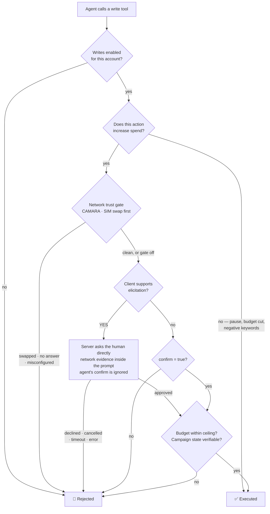
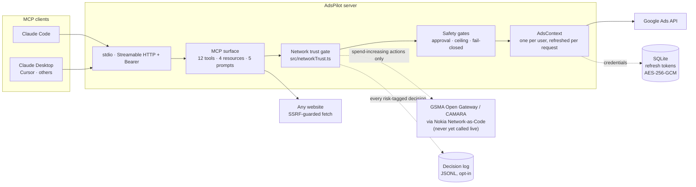
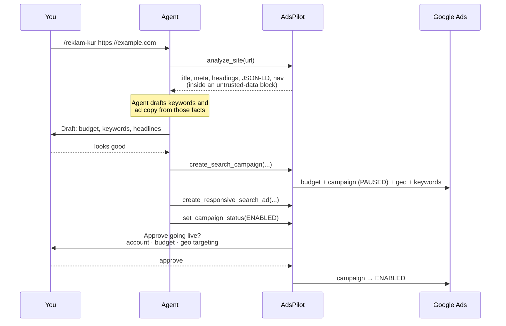

<!-- SPDX-License-Identifier: AGPL-3.0-only -->
# AdsPilot

**A Google Ads MCP server that lets an AI agent manage real campaigns — without letting it spend your money unsupervised.**

*Aegis, its trust gate, asks the mobile network (GSMA Open Gateway / CAMARA) whether the approver's line was taken over — before any human is prompted, and before any money moves.*

[](https://github.com/Xaena53/google-ads-mcp/actions/workflows/ci.yml)
[](LICENSE)
[](package.json)
[](test/)
[](https://modelcontextprotocol.io)

🇹🇷 [Türkçe README](README.tr.md)

---

Connecting an LLM to an advertising account is easy. Doing it without waking up to a
drained budget is the hard part. Most write-capable integrations solve this by asking
the agent to confirm — which means the *agent* decides whether a human was consulted.

AdsPilot moves that decision out of the agent's hands. When your MCP client supports
[elicitation](https://modelcontextprotocol.io), the server asks **you** directly through
the protocol, and the agent's own `confirm` flag is ignored entirely. Approval stops
being a story the agent tells and becomes a fact the server can verify.

## Network-verified spending approvals

An approval prompt proves that *someone* answered it. It cannot prove that someone was the
account owner. Sessions, tokens, cookies and devices are application-layer artifacts, and
application-layer artifacts get stolen — at which point the attacker inherits the exact
same "are you sure?" dialog the owner would have seen, and answers it just as convincingly.

The mobile network holds evidence the application layer cannot fabricate. Through GSMA Open
Gateway / CAMARA APIs — reached via the Nokia Network-as-Code platform — an operator can
answer questions such as *was this line's SIM swapped in the last 24 hours*, the signature
move of account-takeover fraud. AdsPilot (the gate is called **Aegis**) puts that question
in front of every spend-increasing action: **the network is consulted before the human
prompt is ever shown**. A swapped SIM is refused outright rather than politely offered to
whoever is now holding the line, and the agent's own `confirm` flag is ignored on every
path. Risk is tiered — a budget increase is *medium* and uses a 24 h lookback; taking a
campaign live is *high*, widens the window to the configured value (72 h by default) and
admits further links of the chain.

Every direction of uncertainty fails closed: no token, a missing approver number, an
unrecognised configuration value, contradictory configuration, or an endpoint that does not
answer within 10 s all end in refusal — never in a quiet pass. Raw values never reach the
agent: the evidence line carries a masked number, refusal reasons come from a fixed
vocabulary, and upstream error text goes to stderr only. Each risk-tagged decision —
refusals *and* passes — can be appended to a JSONL audit trail (`ADSPILOT_DECISION_LOG`)
that keeps a **separate channel field per chain link**, so "real query" and "simulated" can
never be flattened into one another.

### Where the chain honestly stands today

Six links are designed; how far each one is built differs, and the difference matters more
than the design does.

| # | CAMARA signal | Question | State in this repo |
|---|---|---|---|
| 1 | `simSwap.check` | Was the approver's line taken over recently? | **Real path written** — live SDK channel + simulation channel + test seam. Runs on every risk-tagged action |
| 2 | `numberVerification.*` | Is the approval coming from the owner's own device? | **Simulation only, permanently for now** — it is a device-side OIDC flow that no back-end can call. Its trace type has no "real" value at all |
| 3 | `deviceStatus.retrieveReachabilityStatus` | Can the line receive data/SMS right now? | **Real path written, opt-in** (`ADSPILOT_REACH_CHECK`), high tier only — reachability legitimately fluctuates, so it stays off by default |
| 4 | `deviceStatus.checkRoaming` | Is the line in the expected country? | **Real path written**, high tier, and only when `ADSPILOT_EXPECTED_COUNTRY` is set — no default country is invented, because a default would answer "clean" forever |
| 5 | `deviceSwap.check` | Was the line moved to a **new device** — the attack SIM Swap cannot see? | **Real path written, opt-in** (`ADSPILOT_DEVICESWAP_CHECK`), high tier only. Shares the SIM-swap window but is logged under its own field; unlike link 1, an unreadable answer is a refusal, not a "no swap" |
| 6 | `callForwardingSignal.retrieveUnconditionalCallForwarding` | Is unconditional call forwarding active — the classic OTP/voice intercept? | **Real path written, opt-in** (`ADSPILOT_CALLFWD_CHECK`), high tier only. One boolean, no PII: which number the line forwards to is never asked for or received |

Links 2–6 run on the **high** tier only, and each needs its own variable: holding a
Network-as-Code token switches on link 1 and nothing else, because every live link adds
another CAMARA round trip to every approval — and another way to refuse a legitimate spend.
A configured-but-disabled link records `kapali` in the audit trail, so "I did not ask" is
never mistaken for "asked and passed".

> **SIM Swap now runs against Nokia's live Network-as-Code endpoint** (verified 2026-08-28):
> a clean line returns `{"swapped":false}` and passes, a swapped line returns
> `{"swapped":true}` and is refused before any prompt, and a line that makes the platform
> return `500` is refused fail-closed with the upstream body redacted. All three landed in
> the decision log as `"simSwapKanali":"gercek"`. **The caveat that matters:** the account is
> in the platform's *Simulator mode*, so the request, auth, routing and response shape are
> real while the subscriber behind the number is Nokia's simulation — the wire is proven, the
> operator integration is not. Links 5 and 6 have since been verified live too — device swap and call forwarding both answer through the gate with a `gercek` trace. Links 3 and 4 are blocked by the account rather than the code: every Device Status path returns `404 Endpoint does not exist` on the free Simulator tier, while the three working links answer `200` with the same key. A green test
> suite remains evidence about **decision logic**, not about the wire.
>
> One finding worth repeating: the SDK does not send the `X-RapidAPI-Host` header, and
> without it every call returns `404 "API doesn't exists"` — correct URL, correct path, valid
> key. One header is the difference between a dead integration and a working one.

The full signal inventory, the type-level proof that Number Verification is uncallable from
a server, and the step-by-step checklist that turns the first live query into recorded fact
are in **[docs/CAMARA.md](docs/CAMARA.md)**.

## Seeing it run

```bash
npm run prova -- --musteri <customer-id>            # preflight; writes nothing
npm run demo  -- --musteri <customer-id>            # three acts, dry by default
npm run demo  -- --musteri <customer-id> --canli    # real +1 budget raise, reverted at once
```

`npm run demo` drives the **real** server binary over real MCP stdio — a fresh server process
per scene, each handed its own simulation value, so nothing in `.env` is flipped mid-demo:
a budget raise on a clean signal (the prompt appears with the network evidence line inside
it), the same raise with a swapped SIM (**hard refusal, zero prompts** — the script counts
elicitations and aborts if one is ever shown), and a high-tier go-live where the lookback
widens to 72 h and, if `ADSPILOT_NV_SIMULATE` is set, a second evidence line appears. Act 3
skips itself rather than stage a scene whose evidence it cannot honestly produce, and any
campaign it takes live is reverted and then **read back** to prove it.

`npm run prova` is the stage-day preflight: it exercises the same real paths (stdio binary,
a live read-only `list_accounts`, a complete dry demo run) and reports each check as
`GEÇTİ` / `UYARI` / `KALDI`, printing which environment variables are present but never
their values. Narration script, act-by-act expected output, the fail-closed matrix and a
glossary of the Turkish runtime strings: **[docs/DEMO.md](docs/DEMO.md)**.

> Aegis — the network-trust gate, its demo and its runbook — was built for the GSMA MENA
> Ignite hackathon (Theme 4).

## How it compares

| | Google official MCP | AdsPilot |
|---|---|---|
| **Campaign writes** | ❌ read-only by design | ✅ create, budget, keywords, ads, enable/pause |
| **Approval model** | n/a | Human asked via MCP elicitation; agent cannot fabricate consent |
| **Fail-closed guards** | n/a | Budget ceiling, paused-by-default, mandatory geo targeting, shared-budget protection |
| **Multi-tenant hosting** | ❌ self-host, single identity | ✅ per-user OAuth, encrypted tokens, session isolation |
| **Site → campaign** | ❌ | ✅ `analyze_site` turns any URL into campaign raw material |
| **Network trust anchor** | ❌ | A six-link CAMARA chain (SIM swap · number verification · reachability · roaming · device swap · call forwarding) *before* the human is prompted — SIM Swap verified live in Simulator mode, links 2-6 written but not yet exercised ([docs](docs/CAMARA.md)) |
| **License** | Apache-2.0 | AGPL-3.0 |

> This table compares Google's official server, which is deliberately read-only and
> therefore solves a different problem. Commercial alternatives (Markifact, Adzviser
> and others) do offer writes, but their internals aren't publicly auditable, so this
> table doesn't speculate about them. Verify current details yourself before choosing.

## The safety model

Every write follows the same decision path. Two branches are worth noticing: the network
gate answers *before* any human is asked, and when elicitation is available the human's
answer is binding while the agent's `confirm` is never consulted.



Four properties are worth calling out:

**The network is asked first.** When the trust gate refuses, the approval prompt is never
rendered at all — because the person who would answer it may be the attacker who took over
the line. An unconfigured gate is pass-through, but says so honestly in the evidence line
and is logged as `kapali`, never as "passed".

**Campaigns are born paused.** No tool in the system can create a campaign that is
already serving. Going live is always a separate, approved step.

**Uncertainty fails closed.** If the server cannot prove a campaign is paused — the
query returned nothing, the status field is missing, the type is unexpected — it asks
for approval rather than assuming safety.

**The agent cannot loosen its own limits.** Budget ceiling and write permission are
readable over MCP but writable only from a human browser session; the API key does not
open that door.

## Architecture



Two deployment shapes share the same core:

- **Local (stdio)** — one user, credentials from `.env`, zero infrastructure.
- **Hosted (HTTP)** — many users, each connecting their own Google account via OAuth.
  Refresh tokens are encrypted at rest, every MCP session is bound to exactly one user,
  and that user's settings are re-read on every request — so a limit change takes effect
  immediately, even mid-session.

## Capabilities

**Tools** — 12 total. "Approval" marks actions that can increase spend and therefore
pass through the gate above.

| Tool | Purpose | Approval |
|---|---|---|
| `list_accounts` | Accessible accounts, including MCC sub-accounts | — |
| `campaign_performance` | Cost, clicks, conversions, CTR, avg. CPC | — |
| `keyword_performance` | Performance of the keywords you added | — |
| `search_terms_report` | What people actually searched; flags wasted spend | — |
| `run_gaql` | Raw GAQL escape hatch (read-only, auto-limited) | — |
| `analyze_site` | Extracts campaign raw material from any URL | — |
| `create_search_campaign` | Budget + campaign + geo + ad group + keywords, atomically | born paused ⇒ no |
| `create_responsive_search_ad` | Adds a responsive search ad to an ad group | if campaign is live |
| `add_keywords` | Keywords or negatives at ad-group level | positives on live campaigns |
| `add_campaign_negative_keywords` | Negatives across a whole campaign | no — reduces spend |
| `update_campaign_budget` | Changes the daily budget | increases only |
| `set_campaign_status` | Enable or pause | enabling only |

**Resources** — browsable data that costs no tool call: `adspilot://accounts` ·
`adspilot://accounts/{id}/campaigns` · `adspilot://accounts/{id}/limits` (your active
guardrails) · `adspilot://gaql-sema` (field reference, so the agent stops inventing
GAQL fields).

**Prompts** — ready-made workflows that appear as slash commands: `/reklam-kur`
(site → draft campaign) · `/israf-bul` (find and cut wasted spend) · `/haftalik-rapor`
· `/kampanya-denetle` · `/guvenlik-durumu`.

> The agent-facing surface (tool descriptions, prompts, error messages) is written in
> Turkish, matching the product's initial market. The protocol, code and these docs are
> English.

## Quick start

Requires **Node ≥ 22.13** — the hosted mode uses the built-in `node:sqlite`.

```bash
git clone https://github.com/Xaena53/google-ads-mcp.git adspilot
cd adspilot
npm ci && npm run build && npm test
```

You need Google Ads API credentials: a developer token from an MCC account, a Google
Cloud project with the Ads API enabled, and an OAuth client. Copy `.env.example` to
`.env`, fill it in, then:

```bash
npm run auth                      # opens a browser, writes the refresh token to .env
claude mcp add adspilot -- node /absolute/path/to/adspilot/dist/index.js
```

Ask Claude *"list my Google Ads accounts"* to confirm the connection.

For the multi-user hosted deployment — systemd unit, nginx config, Docker image, and
the pitfalls that would otherwise cost you an afternoon — see
**[deploy/README.md](deploy/README.md)**.

## Docker

The hosted (HTTP) mode comes up with one command:

```bash
cp .env.example .env        # fill in the four required values
docker compose up --build
curl http://localhost:8787/health          # -> {"ok":true,...}
```

Image layout, the environment table, the jury demo mode (`ADSPILOT_NAC_SIMULATE`, the
simulated CAMARA channel), and troubleshooting live in
**[docs/DOCKER.md](docs/DOCKER.md)**.

## From a URL to a campaign

The flagship workflow. The server extracts *facts*, the client-side model does the
creative work, and a human approves before anything serves.



`analyze_site` fetches arbitrary URLs, so it treats every response as hostile:
private-network and cloud-metadata addresses are blocked at both the hostname and the
resolved-IP level, every redirect hop is re-validated before the request is made,
parsing is linear-time (no catastrophic backtracking), and extracted text is returned
inside a delimited untrusted-data block with forged closing tags stripped.

## Security

The threat model, reporting process, and the five invariants this project holds itself
to live in **[SECURITY.md](SECURITY.md)**. Two of them in short:

- Uncertainty never resolves in favour of spending money.
- The agent cannot raise its own budget ceiling or re-enable writes.

The network trust gate is held to the same rule: if the trust anchor cannot answer, the
spend does not happen — and it never claims a live query it did not make
([docs/CAMARA.md](docs/CAMARA.md)).

Found a hole? Please report it privately through GitHub Security Advisories rather than
a public issue.

## Development

```bash
npm run build      # compile to dist/
npm run typecheck  # src + tests, with noUnusedLocals
npm test           # 454 offline tests
npm run smoke      # live checks against your real Google Ads account
npm run prova -- --musteri <id>   # stage-day preflight for the demo (writes nothing)
npm run demo  -- --musteri <id>   # the three-act network-trust demo, dry by default
```

Tests run a real MCP client/server pair over `InMemoryTransport` with an injected fake
Google Ads context, so every guard is exercised through the actual protocol without
touching a live account. The suite includes fail-closed regressions and adversarial
scenarios that try to reach a bad outcome by every known route. The network gate is tested
the same way — through an injected fake channel, which is what makes the unreachable-API
refusal assertable, and also why those green tests say nothing about the live CAMARA wire.

### Live smoke test

An offline suite can only prove the server is correct against the API *as modelled*.
`npm run smoke` closes that gap: it launches the real stdio binary, speaks MCP exactly as
Claude Desktop does, and verifies each guarantee against Google's live servers.

| Verified | How |
|---|---|
| Server states its rules to the agent | `instructions` non-empty and carries the PAUSED rule |
| Accounts resolve | every ID is 10 digits; unreadable accounts are skipped, not guessed |
| Reports are typed | `structuredContent` matches the declared `outputSchema` |
| Multi-line GAQL loses no field | last `SELECT` field present in returned rows |
| LIMIT ceiling bites | unclamped count measured first, then proven to be cut |
| Guardrails are readable | `adspilot://accounts/{id}/limits` reports cap and write flag |
| Completion suggests real accounts | `completion/complete` returns the live account ID |
| Over-cap budget is refused | refusal **and** the live budget verified unchanged |
| Unapproved go-live is refused | refusal **and** the live status verified unchanged |

The default run performs **no mutation** — spend-related guards are verified through their
refusal path, and a refusal is only accepted as proof once the underlying value is re-read
and found unchanged. A check that cannot be proven by the account's data reports itself as
failed rather than passing quietly.

`npm run smoke -- --write` additionally creates a real campaign and asserts it comes up
`PAUSED`. It prints the new campaign ID for manual deletion: the server intentionally
exposes no delete tool, so the smoke test cannot clean up after itself.

Design decisions and internals: **[ARCHITECTURE.md](ARCHITECTURE.md)**.
Contributing: **[CONTRIBUTING.md](CONTRIBUTING.md)**.

## License

AGPL-3.0-only. Copyright © 2026 [Xaena53](https://github.com/Xaena53).

You may use, modify and redistribute this software. **If you run a modified version as
a network service, AGPL §13 requires you to offer its source to that service's users.**
This project honours that itself: every page footer and the `/source` endpoint link to
the source, and the MCP `instructions` field carries it too. If you fork and deploy,
point `ADSPILOT_SOURCE_URL` at *your* repository — the upstream default will not
satisfy your obligation.
