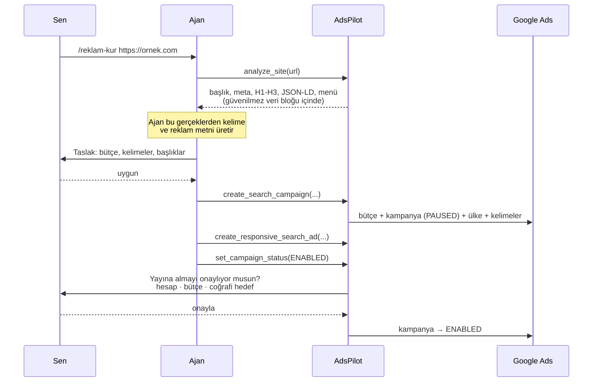
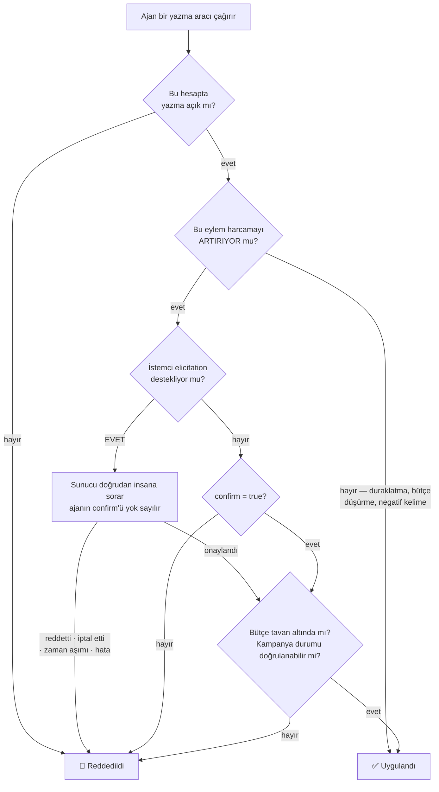
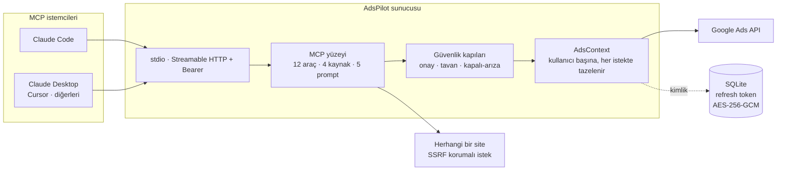

<!-- SPDX-License-Identifier: AGPL-3.0-only -->
# AdsPilot

**Yapay zekâ ajanının gerçek Google Ads kampanyalarını yönetmesini sağlayan MCP sunucusu — paranı denetimsiz harcamasına izin vermeden.**

*Güven kapısı Aegis, onaylayıcının hattının ele geçirilip geçirilmediğini mobil ağa sorar (GSMA Open Gateway / CAMARA) — insana sorulmadan ve para hareket etmeden önce.*

[](https://github.com/Xaena53/google-ads-mcp/actions/workflows/ci.yml)
[](LICENSE)
[](package.json)
[](test/)
[](#test-metrikleri)

🇬🇧 [English README](README.md)

---

Bir dil modelini reklam hesabına bağlamak kolaydır; zor olan, sabah kalktığında
bütçenin yerinde durduğundan emin olmaktır. Yazma yetkisi olan entegrasyonların çoğu
bunu "ajan onaylasın" diyerek çözer — yani insana danışılıp danışılmadığına *ajan*
karar verir.

AdsPilot bu kararı ajanın elinden alır. MCP istemcin
[elicitation](https://modelcontextprotocol.io) destekliyorsa sunucu **doğrudan sana**
sorar ve ajanın kendi `confirm` bayrağı hiç dikkate alınmaz. Onay, ajanın anlattığı
bir hikâye olmaktan çıkıp sunucunun doğrulayabildiği bir olguya dönüşür.

| | |
|---|---|
| **Nedir** | Yapay zekâ ajanının gerçek Google Ads ve Meta kampanyalarını, sunucu taraflı harcama kapıları arkasından yönetmesini sağlayan MCP sunucusu |
| **Fikir** | Onay iddia edilmez, doğrulanır: insana protokol üzerinden sorulur, mobil ağa ise insandan *önce* |
| **Durum** | Çalışan yazılım. Üç CAMARA halkası Nokia'nın canlı platformuna karşı doğrulandı; %94.27 satır kapsamıyla 646 otomatik test; Docker dağıtımı |
| **Henüz yok** | Device Status halkaları (hesap katmanımızda uç nokta yok) · Number Verification (cihaz-taraflı OIDC, sunucudan çağrılamaz) · Meta yazmaları (canlı jeton yok) |

## İçindekiler

- [Hızlı başlangıç](#hızlı-başlangıç) — beş dakikada çalışır hâle
- [Ağ-doğrulamalı harcama onayı](#ağ-doğrulamalı-harcama-onayı) — fikir ve bugünkü dürüst durumu
- [Çalışırken görmek](#çalışırken-görmek) — senaryolu demo ve sahne öncesi ön-uçuş
- [Yetenekler](#yetenekler) · [URL'den kampanyaya](#urlden-kampanyaya)
- [Güvenlik modeli](#güvenlik-modeli) · [Mimari](#mimari) · [Karşılaştırma](#karşılaştırma)
- [Docker](#docker) · [Güvenlik](#güvenlik) · [Geliştirme](#geliştirme) · [Lisans](#lisans)

## Hızlı başlangıç

**Node ≥ 22.13** gerekir — barındırılan mod yerleşik `node:sqlite` kullanır.

```bash
git clone https://github.com/Xaena53/google-ads-mcp.git adspilot
cd adspilot
npm ci && npm run build && npm test
```

Google Ads API kimlik bilgileri gerekir: MCC hesabından bir developer token, Ads API'si
etkin bir Google Cloud projesi ve bir OAuth istemcisi. `.env.example` dosyasını `.env`
olarak kopyalayıp doldur, ardından:

```bash
npm run auth                      # tarayıcı açılır, refresh token .env'e yazılır
claude mcp add adspilot -- node /mutlak/yol/adspilot/dist/index.js
```

Bağlantıyı doğrulamak için Claude'a *"Google Ads hesaplarımı listele"* de.

Çok kullanıcılı kurulum — systemd unit, nginx yapılandırması, Docker imajı ve aksi
halde sana bir öğleden sonraya mal olacak tuzaklar — için:
**[deploy/README.md](deploy/README.md)**.

## Ağ-doğrulamalı harcama onayı

Bir onay istemi, *birinin* cevapladığını kanıtlar; o kişinin hesap sahibi olduğunu
kanıtlayamaz. Oturum, token, çerez ve cihaz uygulama katmanına ait şeylerdir ve uygulama
katmanına ait şeyler çalınır — o andan itibaren saldırgan, sahibin göreceği "emin misin?"
penceresinin aynısını devralır ve onu en az sahibi kadar ikna edici biçimde cevaplar.

Mobil ağ, uygulama katmanının uyduramayacağı bir kanıt tutar. GSMA Open Gateway / CAMARA
API'leri üzerinden — Nokia Network-as-Code platformuyla — operatör *bu hattın SIM kartı son
24 saatte değişti mi* gibi soruları cevaplayabilir; bu, hesap ele geçirme dolandırıcılığının
imza hareketidir. AdsPilot (kapının adı **Aegis**) bu soruyu harcamayı artıran her işlemin
önüne koyar: **ağa, insan istemi gösterilmeden önce sorulur.** Değişmiş bir SIM, hattı artık
elinde tutan kişiye nazikçe sunulmak yerine doğrudan reddedilir ve ajanın kendi `confirm`
bayrağı her yolda yok sayılır. Risk kademelidir: bütçe artışı *orta* seviyedir ve 24 saatlik
geriye bakış kullanır; kampanyayı yayına almak *yüksek* seviyedir, pencereyi yapılandırılan
değere (varsayılan 72 saat) genişletir ve zincirin sonraki halkalarını devreye sokar.

Belirsizliğin her yönü kapalı arızaya düşer: token yok, onaylayıcı numarası eksik,
tanınmayan bir yapılandırma değeri, çelişkili yapılandırma ya da 10 saniyede cevap vermeyen
bir uç nokta — hepsi retle biter, hiçbiri sessiz geçişle. Ham değerler ajana ulaşmaz: kanıt
satırı maskeli numara taşır, ret nedenleri sabit bir sözlükten gelir, upstream hata metni
yalnız stderr'e gider. Risk etiketli her karar — retler *ve* geçişler — JSONL denetim izine
yazılabilir (`ADSPILOT_DECISION_LOG`) ve iz, **her zincir halkası için ayrı bir kanal alanı**
tutar; böylece "gerçek sorgu" ile "simülasyon" birbirine karışamaz.

### Zincirin bugünkü dürüst durumu

Altı halka tasarlandı; her birinin ne kadarının inşa edildiği farklıdır ve bu fark,
tasarımın kendisinden daha önemlidir.

| # | CAMARA sinyali | Sorduğu soru | Bu depodaki durumu |
|---|---|---|---|
| 1 | `simSwap.check` | Onaylayıcının hattı yakın zamanda ele geçirildi mi? | **Gerçek yol yazılı** — canlı SDK kanalı + simülasyon kanalı + test dikişi. Risk etiketli her işlemde koşar |
| 2 | `numberVerification.*` | Onay, sahibin kendi cihazından mı geliyor? | **Şimdilik kalıcı olarak yalnız simülasyon** (`ADSPILOT_NV_SIMULATE`) — cihaz-taraflı OIDC akışıdır, hiçbir arka uç onu çağıramaz. İz tipinde "gerçek" değeri hiç yoktur |
| 3 | `deviceStatus.retrieveReachabilityStatus` | Hat şu an veri/SMS alabiliyor mu? | **Gerçek yol yazılı, opt-in** (`ADSPILOT_REACH_CHECK`), yalnız yüksek katman — erişilebilirlik meşru olarak dalgalanır, bu yüzden varsayılan kapalıdır |
| 4 | `deviceStatus.checkRoaming` | Hat beklenen ülkede mi? | **Gerçek yol yazılı**, yüksek katman, yalnız `ADSPILOT_EXPECTED_COUNTRY` tanımlıyken — varsayılan ülke uydurulmaz, çünkü uydurulan bir varsayılan sonsuza dek "temiz" cevabı verir |
| 5 | `deviceSwap.check` | Hat son N saatte yeni bir cihaza mı taşındı? | **Gerçek yol yazılı, opt-in** (`ADSPILOT_DEVICESWAP_CHECK`), yüksek katman. SIM Swap'ın yapısal ikizi; okunamayan yanıt "değişim yok" sayılmaz, RET olur |
| 6 | `callForwardingSignal` | Hatta koşulsuz çağrı yönlendirme açık mı? | **Gerçek yol yazılı, opt-in** (`ADSPILOT_CALLFWD_CHECK`), yüksek katman. OTP ele geçirmenin klasik yolu ve önceki beş halkanın göremediği saldırı: aynı SIM, aynı cihaz, hat erişilebilir, ülke beklenen. Yalnız koşulsuz varyant sorulur — tek boolean, PII yok |

> **SIM Swap artık Nokia'nın canlı Network-as-Code uç noktasına karşı koşuyor**
> (2026-08-28'de doğrulandı): temiz hat `{"swapped":false}` döndürüp geçiyor, SIM'i değişmiş
> hat `{"swapped":true}` döndürüp istem gösterilmeden reddediliyor, platformun `500`
> döndürdüğü hat ise upstream gövdesi maskelenerek kapalı arızaya gidiyor. Üçü de karar
> günlüğüne `"simSwapKanali":"gercek"` olarak düştü. **Önemli çekince:** hesap platformun
> *Simulator* kipinde, yani istek, kimlik doğrulama, yönlendirme ve yanıt biçimi gerçek ama
> numaranın arkasındaki abone Nokia'nın simülasyonu — tel kanıtlandı, operatör entegrasyonu
> kanıtlanmadı. 5. ve 6. halkalar da sonradan canlı doğrulandı — cihaz değişimi ve çağrı yönlendirme, kapıdan `gercek` iziyle geçiyor. 3. ve 4. halkayı engelleyen kod değil hesap: ücretsiz Simulator katmanında her Device Status yolu `404 Endpoint does not exist` dönerken, çalışan üç halka aynı anahtarla `200` veriyor. Yeşil test süiti hâlâ **karar mantığı**
> hakkında kanıttır, telin çalıştığının değil.
>
> Tekrarlamaya değer bir bulgu: SDK `X-RapidAPI-Host` başlığını göndermiyor ve o başlık
> olmadan her çağrı `404 "API doesn't exists"` dönüyor — doğru URL, doğru yol, geçerli
> anahtarla. Ölü bir entegrasyonla çalışan bir entegrasyon arasındaki fark tek bir başlık.

Tam sinyal envanteri, Number Verification'ın sunucudan çağrılamadığının tip düzeyindeki
kanıtı ve ilk canlı sorguyu kayda geçirecek adım adım kontrol listesi:
**[docs/CAMARA.md](docs/CAMARA.md)**.


### İkinci harcama alanı, aynı kapının arkasında

Kapının *alan-bağımsız* olduğu iddiası — "insana sorulmadan önce ağa sor" kuralının Google
Ads'e özgü bir özellik değil, para hareket ettiren her yolun niteliği olduğu — ikinci bir
platform onun arkasına oturana kadar ucuzdur. **Meta (Facebook/Instagram) o ikinci
platform.** `create_meta_campaign`, `update_meta_campaign_budget` ve
`set_meta_campaign_status` aynı `onayAl` kapısını aynı risk kademeleriyle çağırıyor; yani
CAMARA zinciri Meta'da da insan istemi gösterilmeden önce koşuyor. Kampanyalar orada da
duraklatılmış doğuyor ve aracın tartışılacak bir `status` parametresi yok.

**Hiçbir Meta çağrısı bugüne dek Meta sunucularına ulaşmadı**: erişim jetonu, uygulama
incelemesi ve reklam hesabı yok. İstek biçimleri Marketing API referansından alındı,
testler sahte istemci enjekte ediyor — CAMARA halkalarının üzerinde token gelene kadar
duran çekincenin aynısı, ve aynı şekilde kanıtla değiştirilecek.

Adını anmaya değer bir tuzak, çünkü sessizce sahaya çıkan türden: Meta bütçeleri minor
unit ister, Google micros. Aynı sayıyı iki API'ye göndermek birinde 100 kat hata demek; ve
`1.005 * 100` ikili kayan noktada `100.49999999999999` olduğu için düz bir `Math.round`
müşteriyi sessizce eksiltir. Dönüşüm sabit basamak üzerinden yuvarlanıyor ve bir test bunu
sabitliyor.

## Çalışırken görmek

```bash
npm run prova -- --musteri <musteri-id>            # sahne öncesi ön-uçuş; hiçbir şey yazmaz
npm run demo  -- --musteri <musteri-id>            # üç perde, varsayılan kuru
npm run demo  -- --musteri <musteri-id> --canli    # gerçek +1 bütçe artışı, anında geri alınır
```

`npm run demo` **gerçek** sunucu ikilisini gerçek MCP stdio üzerinden sürer — her sahneye
kendi simülasyon değeri verilmiş ayrı bir sunucu süreci, böylece demo ortasında `.env`
değiştirilmez: temiz sinyalde bütçe artışı (istem, içinde ağ kanıtı satırıyla belirir),
aynı artış değişmiş SIM'le (**sert ret, sıfır istem** — betik elicitation sayar ve bir tane
bile gösterilirse durur) ve yüksek katmanda yayına alma (pencere 72 saate genişler).
Perde 3, dürüstçe üretemeyeceği bir kanıtı sahnelemektense kendini atlar; yayına aldığı
kampanyayı geri alır ve durumu **geri okuyarak** kanıtlar.

`npm run prova` sahne günü ön-uçuşudur: aynı gerçek yolları koşturur (stdio ikilisi, canlı
salt-okunur `list_accounts`, eksiksiz bir kuru demo koşusu) ve her kontrolü `GEÇTİ` /
`UYARI` / `KALDI` olarak raporlar; hangi ortam değişkeninin tanımlı olduğunu söyler ama
değerlerini asla basmaz. Anlatım metni, perde perde beklenen çıktı ve kapalı-arıza matrisi:
**[docs/DEMO.md](docs/DEMO.md)**.

> Aegis — ağ-güven kapısı, demosu ve runbook'u — GSMA MENA Ignite hackathon'u (Tema 4)
> için geliştirildi.

## Yetenekler

**Araçlar** — 12 adet. "Onay" sütunu, harcamayı artırabilen ve bu yüzden yukarıdaki
kapıdan geçen eylemleri işaretler.

| Araç | Ne yapar | Onay |
|---|---|---|
| `list_accounts` | Erişilebilir hesaplar, MCC alt hesapları dahil | — |
| `campaign_performance` | Maliyet, tıklama, dönüşüm, CTR, ort. TBM | — |
| `keyword_performance` | Senin eklediğin anahtar kelimelerin performansı | — |
| `search_terms_report` | İnsanların gerçekte ne aradığı; israfı işaretler | — |
| `run_gaql` | Ham GAQL çıkış kapısı (salt okunur, otomatik sınırlı) | — |
| `analyze_site` | Herhangi bir URL'den kampanya hammaddesi çıkarır | — |
| `create_search_campaign` | Bütçe + kampanya + ülke + reklam grubu + kelimeler, atomik | duraklatılmış doğar ⇒ hayır |
| `create_responsive_search_ad` | Reklam grubuna duyarlı arama reklamı ekler | kampanya yayındaysa |
| `add_keywords` | Reklam grubu seviyesinde kelime/negatif | canlıda pozitif kelime |
| `add_campaign_negative_keywords` | Kampanya genelinde negatif kelime | hayır — harcamayı azaltır |
| `update_campaign_budget` | Günlük bütçeyi değiştirir | yalnız artışta |
| `set_campaign_status` | Yayına alır ya da duraklatır | yalnız yayına almada |

**Kaynaklar** — araç çağırmadan okunabilen veri: `adspilot://accounts` ·
`adspilot://accounts/{id}/campaigns` · `adspilot://accounts/{id}/limits` (etkin
kelepçelerin) · `adspilot://gaql-sema` (alan rehberi — ajan GAQL alanı uydurmasın).

**Prompt'lar** — slash komut olarak görünen hazır iş akışları: `/reklam-kur`
(siteden taslak kampanya) · `/israf-bul` (boşa harcamayı bul ve kes) ·
`/haftalik-rapor` · `/kampanya-denetle` · `/guvenlik-durumu`.

## URL'den kampanyaya

Ürünün amiral iş akışı. Sunucu *gerçekleri* çıkarır, yaratıcı işi istemci tarafındaki
model yapar, yayına almadan önce insan onaylar.



`analyze_site` keyfi URL'ler çektiği için gelen her yanıtı düşman kabul eder: özel ağ
ve bulut metadata adresleri hem alan adı hem çözümlenen IP düzeyinde engellenir, her
yönlendirme durağı istek atılmadan ÖNCE yeniden doğrulanır, ayrıştırma doğrusal
zamanlıdır (katastrofik geri izleme yok) ve çıkarılan metin, sahte kapanış etiketleri
temizlenmiş bir güvenilmez-veri bloğu içinde döner.

## Güvenlik modeli

Her yazma aynı karar yolundan geçer. Dikkat edilmesi gereken yer kalın yazılmış dal:
elicitation varsa insanın cevabı bağlayıcıdır ve ajanın `confirm` değerine hiç
bakılmaz.



Üç özellik özellikle önemli:

**Kampanyalar duraklatılmış doğar.** Sistemdeki hiçbir araç yayında bir kampanya
oluşturamaz. Yayına alma her zaman ayrı ve onaylı bir adımdır.

**Belirsizlik güvenli tarafa düşer.** Sunucu bir kampanyanın duraklatılmış olduğunu
kanıtlayamıyorsa — sorgu boş döndü, durum alanı eksik, tip beklenmedik — güvenli
varsaymak yerine onay ister.

**Ajan kendi kelepçesini gevşetemez.** Bütçe tavanı ve yazma izni MCP üzerinden
okunabilir ama yalnız insanın tarayıcı oturumundan değiştirilebilir; API anahtarı bu
kapıyı açmaz.

## Mimari



Aynı çekirdeği paylaşan iki dağıtım biçimi var:

- **Yerel (stdio)** — tek kullanıcı, kimlik `.env`'den, sıfır altyapı.
- **Barındırılan (HTTP)** — çok kullanıcılı; herkes kendi Google hesabını OAuth ile
  bağlar. Refresh token'lar şifreli saklanır, her MCP oturumu tek bir kullanıcıya
  bağlıdır ve o kullanıcının ayarları her istekte yeniden okunur — yani bir limit
  değişikliği oturum açıkken bile anında geçerli olur.

## Karşılaştırma

| | Google resmi MCP | AdsPilot |
|---|---|---|
| **Kampanya yazma** | ❌ tasarım gereği salt okunur | ✅ kurma, bütçe, kelime, reklam, yayına alma |
| **Onay modeli** | yok | İnsana MCP elicitation ile sorulur; ajan onay uyduramaz |
| **Kapalı-arıza kapılar** | yok | Bütçe tavanı, duraklatılmış doğma, zorunlu ülke hedefi, paylaşımlı bütçe koruması |
| **Çok kiracılı barındırma** | ❌ tek kimlik, kendi sunucunda | ✅ kullanıcı başına OAuth, şifreli token, oturum izolasyonu |
| **Siteden kampanyaya** | ❌ | ✅ `analyze_site` herhangi bir URL'yi kampanya hammaddesine çevirir |
| **Ağ güven çapası** | ❌ | İnsana sorulmadan *önce* CAMARA SIM-Swap kontrolü — canlı uç noktaya karşı doğrulandı, Simulator kipi ([belge](docs/CAMARA.md)) |
| **Lisans** | Apache-2.0 | AGPL-3.0 |

> Tablo, Google'ın bilinçli olarak salt-okunur tasarlanmış resmi sunucusunu
> karşılaştırır — o farklı bir problemi çözüyor. Ticari alternatifler (Markifact,
> Adzviser vb.) yazma sunuyor, ancak iç yapıları kamuya açık biçimde denetlenebilir
> olmadığı için bu tablo onlar hakkında tahmin yürütmüyor. Seçim yapmadan önce güncel
> bilgileri kendin doğrula.

## Docker

Barındırılan (HTTP) mod tek komutla ayağa kalkar:

```bash
cp .env.example .env        # dört zorunlu değeri doldur
docker compose up --build
curl http://localhost:8787/health          # -> {"ok":true,...}
```

İmaj yapısı, ortam değişkeni tablosu, jüri demo modu (`ADSPILOT_NAC_SIMULATE`) ve sorun
giderme: **[docs/DOCKER.md](docs/DOCKER.md)**.

## Güvenlik

Tehdit modeli, bildirim süreci ve projenin kendine koyduğu beş değişmez
**[SECURITY.md](SECURITY.md)** dosyasında. İkisi kısaca:

- Belirsizlik hiçbir zaman para harcama lehine çözülmez.
- Ajan kendi bütçe tavanını yükseltemez, yazma iznini geri açamaz.

Açık bulduysan lütfen herkese açık issue yerine GitHub Security Advisories üzerinden
özel olarak bildir.

## Geliştirme

```bash
npm run build      # dist/ derlemesi
npm run typecheck  # src + testler, noUnusedLocals ile
npm test           # 646 çevrimdışı test
npm run smoke      # gerçek Google Ads hesabına karşı canlı kontroller
```

Testler, enjekte edilmiş sahte bir Google Ads context'iyle `InMemoryTransport` üzerinde
gerçek bir MCP istemci/sunucu çifti çalıştırır; böylece her kapı canlı hesaba
dokunmadan, protokolün tamamı üzerinden sınanır. Pakette kapalı-arıza regresyonları ve
kötü sonuca bilinen her yoldan ulaşmayı deneyen saldırgan senaryolar da var.

### Test metrikleri

```
646 test · 0 hata          satır %94.27  ·  dal %88.86  ·  fonksiyon %92.80
```

| Alan | Satır | Dal | Fonksiyon |
|---|---|---|---|
| `kararGunlugu.ts` · `rateLimit.ts` · `approval.ts` · `config.ts` | %100 | %94–100 | %100 |
| `networkTrust.ts` — altı halkalı güven zinciri | %98.60 | %95.82 | %97.06 |
| `meta/client.ts` · `adsClient.ts` · `store.ts` | %97–99 | %86–92 | %80–100 |
| `tools/` — write, read, site, meta | %94–98 | %65–83 | %80–96 |
| `scripts/brain/` — Growth Brain modülleri | %93–100 | %86–99 | %95–100 |

`scripts/growth-brain.mjs` %39.86'da duruyor; orası mantık değil CLI giriş noktası:
argüman işleme ve terminal çıktısı kapsanmıyor. Asıl önemli parça — her yazmanın önünde
duran insan onay kapısı — enjekte edilen bir akış üzerinden doğrudan test ediliyor.

**Burada asıl ölçüt kapsam değil.** Kapsam bir satırın çalıştığını söyler, ne yaptığının
kontrol edildiğini değil. Bu depodaki her kapı bunun yerine mutasyonla doğrulanır:
kapıyı kır, paketin kızardığını gör, geri al. Kaldırıldığında paket yeşil kalan bir kapı,
kapsamı ne olursa olsun test edilmiş bir kapı değildir.

Bu ayrım defalarca "kapı çalışıyor sanmak" ile "çalıştığını bilmek" arasındaki fark oldu.
Canlı kod olan, kapsamı görünen, ama arkasında testi olmayan kapılar arasında şunlar
vardı: Google yayına alma yolundaki günlük bütçe tavanı (okunamayan bütçe `0` sayılıyor,
`0` da her tavanı geçiyordu), Meta kampanyalarının duraklatılmış doğması, Meta hata
metinlerinden erişim jetonunun temizlenmesi ve yönlendirme adımlarındaki SSRF protokol/port
kontrolleri. Her biri paket yeşil kalarak silinebilirdi. Artık silinemez.

Aynı disiplin, hiçbir testin sormadığı iki hatayı da ortaya çıkardı: rapor özetleri
süzülmemiş satırları sayarken süzülmüş tabloyu basıyordu ve negatif tutarı eleyen iki
katman birbirini maskeliyordu — yani ikisinin de çalıştığı gösterilemiyordu.

### Canlı duman testi

Çevrimdışı paket, sunucunun yalnızca *modellendiği haliyle* API'ye karşı doğru olduğunu
kanıtlayabilir. `npm run smoke` bu boşluğu kapatır: gerçek stdio ikilisini başlatır,
Claude Desktop'ın konuştuğu gibi MCP konuşur ve her vaadi Google'ın canlı sunucularına
karşı doğrular.

| Doğrulanan | Nasıl |
|---|---|
| Sunucu kurallarını ajana anlatıyor | `instructions` dolu ve DURAKLATILMIŞ kuralını taşıyor |
| Hesaplar çözülüyor | her ID 10 hane; okunamayan hesap tahmin edilmiyor, atlanıyor |
| Raporlar tipli | `structuredContent` bildirilen `outputSchema` ile uyuşuyor |
| Çok satırlı GAQL alan kaybetmiyor | son `SELECT` alanı dönen satırlarda mevcut |
| LIMIT tavanı gerçekten kesiyor | önce kırpmasız sayı ölçülüyor, sonra kesildiği kanıtlanıyor |
| Kelepçeler okunabiliyor | `adspilot://accounts/{id}/limits` tavanı ve yazma iznini bildiriyor |
| Tamamlama gerçek hesabı öneriyor | `completion/complete` canlı hesap ID'sini döndürüyor |
| Tavan üstü bütçe reddediliyor | ret **ve** canlı bütçenin değişmediği doğrulanıyor |
| Onaysız yayına alma reddediliyor | ret **ve** canlı durumun değişmediği doğrulanıyor |

Varsayılan çalıştırma **hiçbir şeyi değiştirmez** — harcamayla ilgili kapılar reddetme
yolundan doğrulanır ve bir ret, ancak altındaki değer yeniden okunup değişmediği
görüldüğünde kanıt sayılır. Hesabın verisiyle kanıtlanamayan bir kontrol, sessizce
geçmek yerine kendini başarısız bildirir.

`npm run smoke -- --write` ek olarak gerçek bir kampanya oluşturur ve `PAUSED` doğduğunu
doğrular. Yeni kampanya ID'sini elle silmen için yazdırır: sunucuda bilinçli olarak silme
aracı yok, bu yüzden duman testi kendi artığını temizleyemez.

Tasarım kararları ve iç yapı: **[ARCHITECTURE.md](ARCHITECTURE.md)**.
Katkı: **[CONTRIBUTING.md](CONTRIBUTING.md)**.

Sürüm sürüm ne değiştiği: **[CHANGELOG.md](CHANGELOG.md)**.

## Lisans

AGPL-3.0-only. Telif © 2026 [Xaena53](https://github.com/Xaena53).

Bu yazılımı kullanabilir, değiştirebilir ve dağıtabilirsin. **Değiştirilmiş bir
sürümünü ağ üzerinden servis olarak sunuyorsan AGPL §13 gereği o servisin
kullanıcılarına kaynağı sunmakla yükümlüsün.** Proje bu yükümlülüğü kendisi de yerine
getirir: her sayfa altbilgisi ve `/source` uç noktası kaynağa bağlantı verir, MCP
`instructions` alanı da bunu taşır. Fork edip dağıtıyorsan `ADSPILOT_SOURCE_URL`
değişkenini **kendi** deponu gösterecek şekilde ayarla — upstream varsayılanı senin
yükümlülüğünü karşılamaz.
