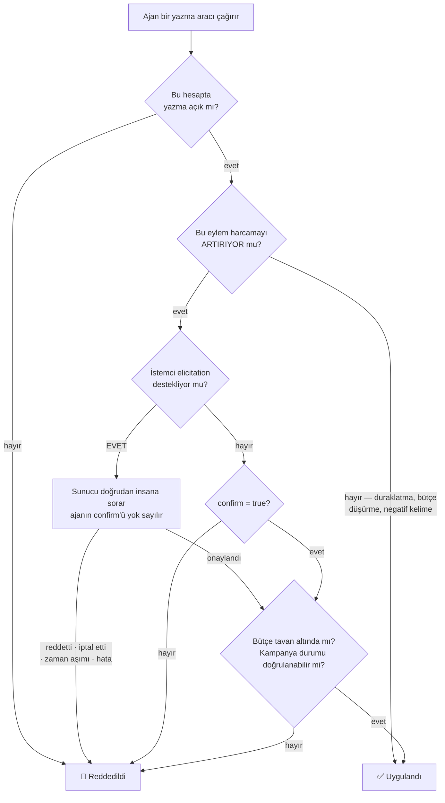
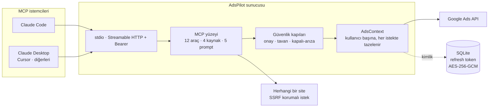
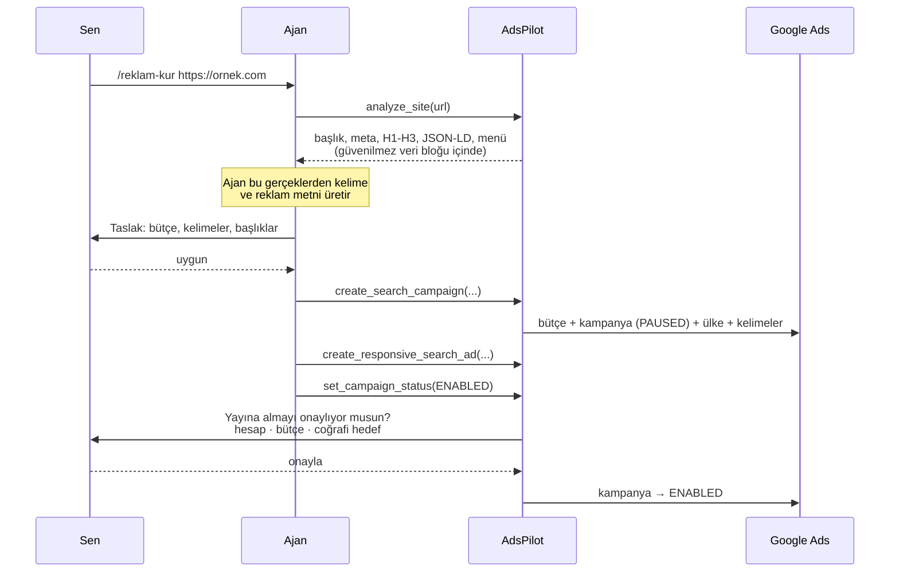

<!-- SPDX-License-Identifier: AGPL-3.0-only -->
# AdsPilot

**Yapay zekâ ajanının gerçek Google Ads kampanyalarını yönetmesini sağlayan MCP sunucusu — paranı denetimsiz harcamasına izin vermeden.**

[](https://github.com/Xaena53/google-ads-mcp/actions/workflows/ci.yml)
[](LICENSE)
[](package.json)
[](test/)

🇬🇧 [English README](README.md)

---

Bir dil modelini reklam hesabına bağlamak kolaydır; zor olan, sabah kalktığında
bütçenin yerinde durduğundan emin olmaktır. Yazma yetkisi olan entegrasyonların çoğu
bunu "ajan onaylasın" diyerek çözer — yani insana danışılıp danışılmadığına *ajan*
karar verir.

AdsPilot bu kararı ajanın elinden alır. MCP istemcin
[elicitation](https://modelcontextprotocol.io) destekliyorsa sunucu **doğrudan sana**
sorar ve ajanın kendi `confirm` bayrağı hiç dikkate alınmaz. Onay, ajanın anlattığı
bir hikâye olmaktan çıkıp sunucunun doğrulayabildiği bir olguya dönüşür.

## Karşılaştırma

| | Google resmi MCP | AdsPilot |
|---|---|---|
| **Kampanya yazma** | ❌ tasarım gereği salt okunur | ✅ kurma, bütçe, kelime, reklam, yayına alma |
| **Onay modeli** | yok | İnsana MCP elicitation ile sorulur; ajan onay uyduramaz |
| **Kapalı-arıza kapılar** | yok | Bütçe tavanı, duraklatılmış doğma, zorunlu ülke hedefi, paylaşımlı bütçe koruması |
| **Çok kiracılı barındırma** | ❌ tek kimlik, kendi sunucunda | ✅ kullanıcı başına OAuth, şifreli token, oturum izolasyonu |
| **Siteden kampanyaya** | ❌ | ✅ `analyze_site` herhangi bir URL'yi kampanya hammaddesine çevirir |
| **Lisans** | Apache-2.0 | AGPL-3.0 |

> Tablo, Google'ın bilinçli olarak salt-okunur tasarlanmış resmi sunucusunu
> karşılaştırır — o farklı bir problemi çözüyor. Ticari alternatifler (Markifact,
> Adzviser vb.) yazma sunuyor, ancak iç yapıları kamuya açık biçimde denetlenebilir
> olmadığı için bu tablo onlar hakkında tahmin yürütmüyor. Seçim yapmadan önce güncel
> bilgileri kendin doğrula.

## Güvenlik modeli

Her yazma aynı karar yolundan geçer. Dikkat edilmesi gereken yer kalın yazılmış dal:
elicitation varsa insanın cevabı bağlayıcıdır ve ajanın `confirm` değerine hiç
bakılmaz.



Üç özellik özellikle önemli:

**Kampanyalar duraklatılmış doğar.** Sistemdeki hiçbir araç yayında bir kampanya
oluşturamaz. Yayına alma her zaman ayrı ve onaylı bir adımdır.

**Belirsizlik güvenli tarafa düşer.** Sunucu bir kampanyanın duraklatılmış olduğunu
kanıtlayamıyorsa — sorgu boş döndü, durum alanı eksik, tip beklenmedik — güvenli
varsaymak yerine onay ister.

**Ajan kendi kelepçesini gevşetemez.** Bütçe tavanı ve yazma izni MCP üzerinden
okunabilir ama yalnız insanın tarayıcı oturumundan değiştirilebilir; API anahtarı bu
kapıyı açmaz.

## Mimari



Aynı çekirdeği paylaşan iki dağıtım biçimi var:

- **Yerel (stdio)** — tek kullanıcı, kimlik `.env`'den, sıfır altyapı.
- **Barındırılan (HTTP)** — çok kullanıcılı; herkes kendi Google hesabını OAuth ile
  bağlar. Refresh token'lar şifreli saklanır, her MCP oturumu tek bir kullanıcıya
  bağlıdır ve o kullanıcının ayarları her istekte yeniden okunur — yani bir limit
  değişikliği oturum açıkken bile anında geçerli olur.

## Yetenekler

**Araçlar** — 12 adet. "Onay" sütunu, harcamayı artırabilen ve bu yüzden yukarıdaki
kapıdan geçen eylemleri işaretler.

| Araç | Ne yapar | Onay |
|---|---|---|
| `list_accounts` | Erişilebilir hesaplar, MCC alt hesapları dahil | — |
| `campaign_performance` | Maliyet, tıklama, dönüşüm, CTR, ort. TBM | — |
| `keyword_performance` | Senin eklediğin anahtar kelimelerin performansı | — |
| `search_terms_report` | İnsanların gerçekte ne aradığı; israfı işaretler | — |
| `run_gaql` | Ham GAQL çıkış kapısı (salt okunur, otomatik sınırlı) | — |
| `analyze_site` | Herhangi bir URL'den kampanya hammaddesi çıkarır | — |
| `create_search_campaign` | Bütçe + kampanya + ülke + reklam grubu + kelimeler, atomik | duraklatılmış doğar ⇒ hayır |
| `create_responsive_search_ad` | Reklam grubuna duyarlı arama reklamı ekler | kampanya yayındaysa |
| `add_keywords` | Reklam grubu seviyesinde kelime/negatif | canlıda pozitif kelime |
| `add_campaign_negative_keywords` | Kampanya genelinde negatif kelime | hayır — harcamayı azaltır |
| `update_campaign_budget` | Günlük bütçeyi değiştirir | yalnız artışta |
| `set_campaign_status` | Yayına alır ya da duraklatır | yalnız yayına almada |

**Kaynaklar** — araç çağırmadan okunabilen veri: `adspilot://accounts` ·
`adspilot://accounts/{id}/campaigns` · `adspilot://accounts/{id}/limits` (etkin
kelepçelerin) · `adspilot://gaql-sema` (alan rehberi — ajan GAQL alanı uydurmasın).

**Prompt'lar** — slash komut olarak görünen hazır iş akışları: `/reklam-kur`
(siteden taslak kampanya) · `/israf-bul` (boşa harcamayı bul ve kes) ·
`/haftalik-rapor` · `/kampanya-denetle` · `/guvenlik-durumu`.

## Hızlı başlangıç

**Node ≥ 22.13** gerekir — barındırılan mod yerleşik `node:sqlite` kullanır.

```bash
git clone https://github.com/Xaena53/google-ads-mcp.git adspilot
cd adspilot
npm ci && npm run build && npm test
```

Google Ads API kimlik bilgileri gerekir: MCC hesabından bir developer token, Ads API'si
etkin bir Google Cloud projesi ve bir OAuth istemcisi. `.env.example` dosyasını `.env`
olarak kopyalayıp doldur, ardından:

```bash
npm run auth                      # tarayıcı açılır, refresh token .env'e yazılır
claude mcp add adspilot -- node /mutlak/yol/adspilot/dist/index.js
```

Bağlantıyı doğrulamak için Claude'a *"Google Ads hesaplarımı listele"* de.

Çok kullanıcılı kurulum — systemd unit, nginx yapılandırması, Docker imajı ve aksi
halde sana bir öğleden sonraya mal olacak tuzaklar — için:
**[deploy/README.md](deploy/README.md)**.

## URL'den kampanyaya

Ürünün amiral iş akışı. Sunucu *gerçekleri* çıkarır, yaratıcı işi istemci tarafındaki
model yapar, yayına almadan önce insan onaylar.



`analyze_site` keyfi URL'ler çektiği için gelen her yanıtı düşman kabul eder: özel ağ
ve bulut metadata adresleri hem alan adı hem çözümlenen IP düzeyinde engellenir, her
yönlendirme durağı istek atılmadan ÖNCE yeniden doğrulanır, ayrıştırma doğrusal
zamanlıdır (katastrofik geri izleme yok) ve çıkarılan metin, sahte kapanış etiketleri
temizlenmiş bir güvenilmez-veri bloğu içinde döner.

## Güvenlik

Tehdit modeli, bildirim süreci ve projenin kendine koyduğu beş değişmez
**[SECURITY.md](SECURITY.md)** dosyasında. İkisi kısaca:

- Belirsizlik hiçbir zaman para harcama lehine çözülmez.
- Ajan kendi bütçe tavanını yükseltemez, yazma iznini geri açamaz.

Açık bulduysan lütfen herkese açık issue yerine GitHub Security Advisories üzerinden
özel olarak bildir.

## Geliştirme

```bash
npm run build      # dist/ derlemesi
npm run typecheck  # src + testler, noUnusedLocals ile
npm test           # 155 çevrimdışı test
npm run smoke      # gerçek Google Ads hesabına karşı canlı kontroller
```

Testler, enjekte edilmiş sahte bir Google Ads context'iyle `InMemoryTransport` üzerinde
gerçek bir MCP istemci/sunucu çifti çalıştırır; böylece her kapı canlı hesaba
dokunmadan, protokolün tamamı üzerinden sınanır. Pakette kapalı-arıza regresyonları ve
kötü sonuca bilinen her yoldan ulaşmayı deneyen saldırgan senaryolar da var.

### Canlı duman testi

Çevrimdışı paket, sunucunun yalnızca *modellendiği haliyle* API'ye karşı doğru olduğunu
kanıtlayabilir. `npm run smoke` bu boşluğu kapatır: gerçek stdio ikilisini başlatır,
Claude Desktop'ın konuştuğu gibi MCP konuşur ve her vaadi Google'ın canlı sunucularına
karşı doğrular.

| Doğrulanan | Nasıl |
|---|---|
| Sunucu kurallarını ajana anlatıyor | `instructions` dolu ve DURAKLATILMIŞ kuralını taşıyor |
| Hesaplar çözülüyor | her ID 10 hane; okunamayan hesap tahmin edilmiyor, atlanıyor |
| Raporlar tipli | `structuredContent` bildirilen `outputSchema` ile uyuşuyor |
| Çok satırlı GAQL alan kaybetmiyor | son `SELECT` alanı dönen satırlarda mevcut |
| LIMIT tavanı gerçekten kesiyor | önce kırpmasız sayı ölçülüyor, sonra kesildiği kanıtlanıyor |
| Kelepçeler okunabiliyor | `adspilot://accounts/{id}/limits` tavanı ve yazma iznini bildiriyor |
| Tamamlama gerçek hesabı öneriyor | `completion/complete` canlı hesap ID'sini döndürüyor |
| Tavan üstü bütçe reddediliyor | ret **ve** canlı bütçenin değişmediği doğrulanıyor |
| Onaysız yayına alma reddediliyor | ret **ve** canlı durumun değişmediği doğrulanıyor |

Varsayılan çalıştırma **hiçbir şeyi değiştirmez** — harcamayla ilgili kapılar reddetme
yolundan doğrulanır ve bir ret, ancak altındaki değer yeniden okunup değişmediği
görüldüğünde kanıt sayılır. Hesabın verisiyle kanıtlanamayan bir kontrol, sessizce
geçmek yerine kendini başarısız bildirir.

`npm run smoke -- --write` ek olarak gerçek bir kampanya oluşturur ve `PAUSED` doğduğunu
doğrular. Yeni kampanya ID'sini elle silmen için yazdırır: sunucuda bilinçli olarak silme
aracı yok, bu yüzden duman testi kendi artığını temizleyemez.

Tasarım kararları ve iç yapı: **[ARCHITECTURE.md](ARCHITECTURE.md)**.
Katkı: **[CONTRIBUTING.md](CONTRIBUTING.md)**.

## Lisans

AGPL-3.0-only. Telif © 2026 [Xaena53](https://github.com/Xaena53).

Bu yazılımı kullanabilir, değiştirebilir ve dağıtabilirsin. **Değiştirilmiş bir
sürümünü ağ üzerinden servis olarak sunuyorsan AGPL §13 gereği o servisin
kullanıcılarına kaynağı sunmakla yükümlüsün.** Proje bu yükümlülüğü kendisi de yerine
getirir: her sayfa altbilgisi ve `/source` uç noktası kaynağa bağlantı verir, MCP
`instructions` alanı da bunu taşır. Fork edip dağıtıyorsan `ADSPILOT_SOURCE_URL`
değişkenini **kendi** deponu gösterecek şekilde ayarla — upstream varsayılanı senin
yükümlülüğünü karşılamaz.
