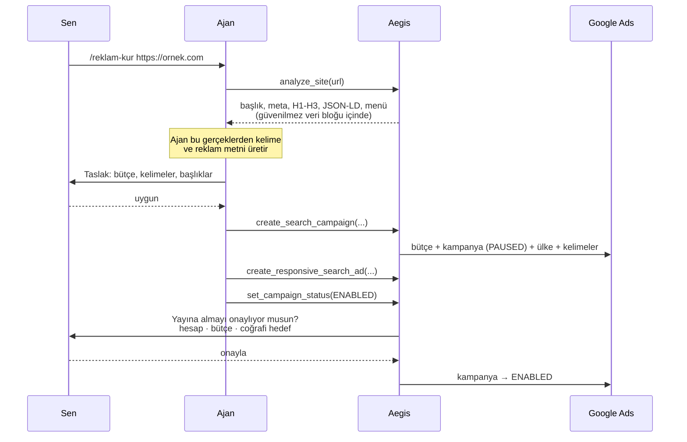
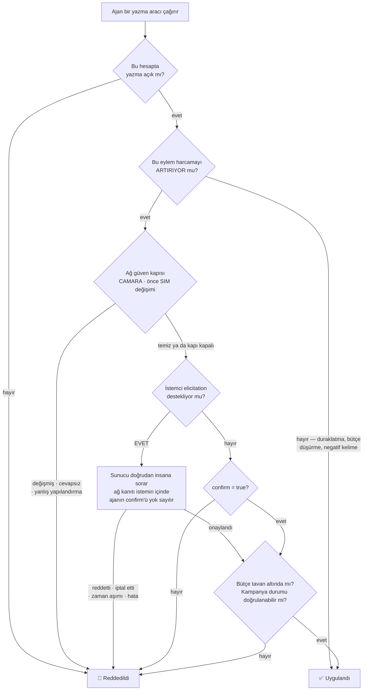
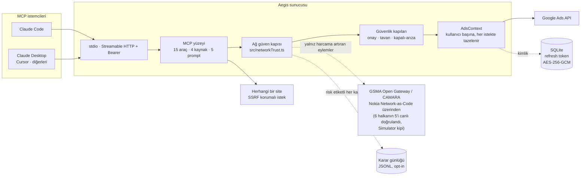

<!-- SPDX-License-Identifier: AGPL-3.0-only -->
# Aegis

**Yapay zekâ ajanının gerçek Google Ads kampanyalarını yönetmesini sağlayan MCP sunucusu — paranı denetimsiz harcamasına izin vermeden.**

*Güven kapısı Aegis, onaylayıcının hattının ele geçirilip geçirilmediğini mobil ağa sorar (GSMA Open Gateway / CAMARA) — insana sorulmadan ve para hareket etmeden önce.*

[](https://github.com/Xaena53/aegis/actions/workflows/ci.yml)
[](LICENSE)
[](package.json)
[](test/)
[](#test-metrikleri)

🇬🇧 [English README](README.md)

---

Bir dil modelini reklam hesabına bağlamak kolaydır; zor olan, sabah kalktığında
bütçenin yerinde durduğundan emin olmaktır. Yazma yetkisi olan entegrasyonların çoğu
bunu "ajan onaylasın" diyerek çözer — yani insana danışılıp danışılmadığına *ajan*
karar verir.

Aegis bu kararı ajanın elinden alır. MCP istemcin
[elicitation](https://modelcontextprotocol.io) destekliyorsa sunucu **doğrudan sana**
sorar ve ajanın kendi `confirm` bayrağı hiç dikkate alınmaz. Onay, ajanın anlattığı
bir hikâye olmaktan çıkıp sunucunun doğrulayabildiği bir olguya dönüşür.

| | |
|---|---|
| **Nedir** | Yapay zekâ ajanının gerçek Google Ads ve Meta kampanyalarını, sunucu taraflı harcama kapıları arkasından yönetmesini sağlayan MCP sunucusu |
| **Fikir** | Onay iddia edilmez, doğrulanır: insana protokol üzerinden sorulur, mobil ağa ise insandan *önce* |
| **Durum** | Çalışan yazılım. Üç entegrasyonun üçü de canlı doğrulandı — Google Ads, altı CAMARA halkasının beşi ve Meta; %90.24 satır kapsamıyla 978 otomatik test; Docker dağıtımı |
| **Henüz yok** | Number Verification (cihaz-taraflı OIDC, sunucudan çağrılamaz — bekleyen bir iş değil, mimari bir hüküm) · CAMARA çağrılarının arkasında gerçek bir abone şebekesi (hesap Simulator kipinde) |

## İçindekiler

- [Hızlı başlangıç](#hızlı-başlangıç) — beş dakikada çalışır hâle
- [Ağ-doğrulamalı harcama onayı](#ağ-doğrulamalı-harcama-onayı) — fikir ve bugünkü dürüst durumu
- [Çalışırken görmek](#çalışırken-görmek) — senaryolu demo ve sahne öncesi ön-uçuş
- [Yetenekler](#yetenekler) · [URL'den kampanyaya](#urlden-kampanyaya)
- [Güvenlik modeli](#güvenlik-modeli) · [Mimari](#mimari) · [Karşılaştırma](#karşılaştırma)
- [Docker](#docker) · [Güvenlik](#güvenlik) · [Geliştirme](#geliştirme) · [Lisans](#lisans)

## Hızlı başlangıç

**Node ≥ 22.13** gerekir — barındırılan mod yerleşik `node:sqlite` kullanır.

```bash
git clone https://github.com/Xaena53/aegis.git aegis
cd aegis
npm ci && npm run build && npm test
```

Google Ads API kimlik bilgileri gerekir: MCC hesabından bir developer token, Ads API'si
etkin bir Google Cloud projesi ve bir OAuth istemcisi. `.env.example` dosyasını `.env`
olarak kopyalayıp doldur, ardından:

```bash
npm run auth                      # tarayıcı açılır, refresh token .env'e yazılır
claude mcp add aegis -- node /mutlak/yol/aegis/dist/index.js
```

Bağlantıyı doğrulamak için Claude'a *"Google Ads hesaplarımı listele"* de.

Çok kullanıcılı kurulum — systemd unit, nginx yapılandırması, Docker imajı ve aksi
halde sana bir öğleden sonraya mal olacak tuzaklar — için:
**[deploy/README.md](deploy/README.md)**.

## Ağ-doğrulamalı harcama onayı

Bir onay istemi, *birinin* cevapladığını kanıtlar; o kişinin hesap sahibi olduğunu
kanıtlayamaz. Oturum, token, çerez ve cihaz uygulama katmanına ait şeylerdir ve uygulama
katmanına ait şeyler çalınır — o andan itibaren saldırgan, sahibin göreceği "emin misin?"
penceresinin aynısını devralır ve onu en az sahibi kadar ikna edici biçimde cevaplar.

Mobil ağ, uygulama katmanının uyduramayacağı bir kanıt tutar. GSMA Open Gateway / CAMARA
API'leri üzerinden — Nokia Network-as-Code platformuyla — operatör *bu hattın SIM kartı son
24 saatte değişti mi* gibi soruları cevaplayabilir; bu, hesap ele geçirme dolandırıcılığının
imza hareketidir. Aegis (kapının adı **Aegis**) bu soruyu harcamayı artıran her işlemin
önüne koyar: **ağa, insan istemi gösterilmeden önce sorulur.** Değişmiş bir SIM, hattı artık
elinde tutan kişiye nazikçe sunulmak yerine doğrudan reddedilir ve ajanın kendi `confirm`
bayrağı her yolda yok sayılır. Risk kademelidir: bütçe artışı *orta* seviyedir ve 24 saatlik
geriye bakış kullanır; kampanyayı yayına almak *yüksek* seviyedir, pencereyi yapılandırılan
değere (varsayılan 72 saat) genişletir ve zincirin sonraki halkalarını devreye sokar.

Belirsizliğin her yönü kapalı arızaya düşer: token yok, onaylayıcı numarası eksik,
tanınmayan bir yapılandırma değeri, çelişkili yapılandırma ya da 10 saniyede cevap vermeyen
bir uç nokta — hepsi retle biter, hiçbiri sessiz geçişle. Ham değerler ajana ulaşmaz: kanıt
satırı maskeli numara taşır, ret nedenleri sabit bir sözlükten gelir, upstream hata metni
yalnız stderr'e gider. Risk etiketli her karar — retler *ve* geçişler — JSONL denetim izine
yazılabilir (`AEGIS_DECISION_LOG`) ve iz, **her zincir halkası için ayrı bir kanal alanı**
tutar; böylece "gerçek sorgu" ile "simülasyon" birbirine karışamaz.

### Zincirin bugünkü dürüst durumu

Altı halka tasarlandı; her birinin ne kadarının inşa edildiği farklıdır ve bu fark,
tasarımın kendisinden daha önemlidir.

| # | CAMARA sinyali | Sorduğu soru | Bu depodaki durumu |
|---|---|---|---|
| 1 | `simSwap.check` | Onaylayıcının hattı yakın zamanda ele geçirildi mi? | **Gerçek yol yazılı** — canlı SDK kanalı + simülasyon kanalı + test dikişi. Risk etiketli her işlemde koşar |
| 2 | `numberVerification.*` | Onay, sahibin kendi cihazından mı geliyor? | **Şimdilik kalıcı olarak yalnız simülasyon** (`AEGIS_NV_SIMULATE`) — cihaz-taraflı OIDC akışıdır, hiçbir arka uç onu çağıramaz. İz tipinde "gerçek" değeri hiç yoktur |
| 3 | `deviceStatus.retrieveReachabilityStatus` | Hat şu an veri/SMS alabiliyor mu? | **Gerçek yol yazılı, opt-in** (`AEGIS_REACH_CHECK`), yalnız yüksek katman — erişilebilirlik meşru olarak dalgalanır, bu yüzden varsayılan kapalıdır |
| 4 | `deviceStatus.checkRoaming` | Hat beklenen ülkede mi? | **Gerçek yol yazılı**, yüksek katman, yalnız `AEGIS_EXPECTED_COUNTRY` tanımlıyken — varsayılan ülke uydurulmaz, çünkü uydurulan bir varsayılan sonsuza dek "temiz" cevabı verir |
| 5 | `deviceSwap.check` | Hat son N saatte yeni bir cihaza mı taşındı? | **Gerçek yol yazılı, opt-in** (`AEGIS_DEVICESWAP_CHECK`), yüksek katman. SIM Swap'ın yapısal ikizi; okunamayan yanıt "değişim yok" sayılmaz, RET olur |
| 6 | `callForwardingSignal` | Hatta koşulsuz çağrı yönlendirme açık mı? | **Gerçek yol yazılı, opt-in** (`AEGIS_CALLFWD_CHECK`), yüksek katman. OTP ele geçirmenin klasik yolu ve önceki beş halkanın göremediği saldırı: aynı SIM, aynı cihaz, hat erişilebilir, ülke beklenen. Yalnız koşulsuz varyant sorulur — tek boolean, PII yok |

> **SIM Swap artık Nokia'nın canlı Network-as-Code uç noktasına karşı koşuyor**
> (2026-08-28'de doğrulandı): temiz hat `{"swapped":false}` döndürüp geçiyor, SIM'i değişmiş
> hat `{"swapped":true}` döndürüp, varsayılan `AEGIS_STEPUP=0` ile istem gösterilmeden reddediliyor
> (kademe açıkken reddetmek yerine insan istemine yükseltiliyor — aşağıya bak), platformun `500`
> döndürdüğü hat ise upstream gövdesi maskelenerek kapalı arızaya gidiyor. Üçü de karar
> günlüğüne `"simSwapKanali":"gercek"` olarak düştü. **Önemli çekince:** hesap platformun
> *Simulator* kipinde, yani istek, kimlik doğrulama, yönlendirme ve yanıt biçimi gerçek ama
> numaranın arkasındaki abone Nokia'nın simülasyonu — tel kanıtlandı, operatör entegrasyonu
> kanıtlanmadı. 5. ve 6. halkalar da sonradan canlı doğrulandı — cihaz değişimi ve çağrı yönlendirme, kapıdan `gercek` iziyle geçiyor. 3. ve 4. halka 31 Ağustos 2026'da canlıya çıktı: haftalarca kovaladığımız `404 Endpoint does not exist`, SDK'nın Device Status için kullanmadığı `/passthrough/camara/v1/` önekini taşıyan ELLE KURULMUŞ URL'lerden geliyordu — hesap katmanından değil. Nokia mentörümüz Aleksi Puranen doğru yolları verdi ve ikisi de kapıdan `200` dönüyor. Böylece altı halkanın beşi canlı doğrulandı; yalnız Number Verification simülasyonda kalıyor, çünkü cihaz-taraflı bir OIDC akışı hiçbir arka uçtan çağrılamaz. Yeşil test süiti hâlâ **karar mantığı**
> hakkında kanıttır, telin çalıştığının değil.
>
> Tekrarlamaya değer bir bulgu: SDK `X-RapidAPI-Host` başlığını göndermiyor ve o başlık
> olmadan her çağrı `404 "API doesn't exists"` dönüyor — doğru URL, doğru yol, geçerli
> anahtarla. Ölü bir entegrasyonla çalışan bir entegrasyon arasındaki fark tek bir başlık.

Tam sinyal envanteri, Number Verification'ın sunucudan çağrılamadığının tip düzeyindeki
kanıtı ve ilk canlı sorguyu kayda geçirecek adım adım kontrol listesi:
**[docs/CAMARA.md](docs/CAMARA.md)**.


### İkinci harcama alanı, aynı kapının arkasında

Kapının *alan-bağımsız* olduğu iddiası — "insana sorulmadan önce ağa sor" kuralının Google
Ads'e özgü bir özellik değil, para hareket ettiren her yolun niteliği olduğu — ikinci bir
platform onun arkasına oturana kadar ucuzdur. **Meta (Facebook/Instagram) o ikinci
platform.** `create_meta_campaign`, `update_meta_campaign_budget` ve
`set_meta_campaign_status` aynı `onayAl` kapısını aynı risk kademeleriyle çağırıyor; yani
CAMARA zinciri Meta'da da insan istemi gösterilmeden önce koşuyor. Kampanyalar orada da
duraklatılmış doğuyor ve aracın tartışılacak bir `status` parametresi yok.

**2 Eylül 2026'dan beri canlı.** Burada duran çekince — jeton yok, reklam hesabı yok, hiçbir
çağrı Meta sunucularına ulaşmadı — kanıtla değiştirildi; CAMARA'da olduğu gibi.
`npm run metatest -- --write` gerçek istemci üzerinden gerçek bir kampanya kuruyor ve en
önemli sözü sınıyor: kampanya DURAKLATILMIŞ doğuyor, Meta onu duraklatılmış geri okuyor ve
bütçe minor-unit gidiş-dönüşünde bozulmuyor. Canlı platforma karşı yedi kontrol, hepsi geçti.

Oraya varmak kayda değer bir sapma gerektirdi, çünkü hata tekrar eden cinsten. İlk canlı
yazma, Meta'nın en az bilgi veren hatasıyla düştü: `500 An unknown error has occurred`.
Jeton sağlamdı, hesap aktifti; yanlış olan reklam hesabı kimliğiydi. Kimlik, Business
Manager URL'sindeki `selected_asset_id` parametresinden okunmuştu — o ise iç varlık
kimliği, reklam hesabı kimliği değil. `me/adaccounts` sorulunca gerçek kimlik anında geldi.
Bu, Device Status 404'lerinin aynısı: yetkili görünen bir şeyden elle türetilmiş bir değer,
oysa API sorulsa söyleyecekti.

Adını anmaya değer bir tuzak, çünkü sessizce sahaya çıkan türden: Meta bütçeleri minor
unit ister, Google micros. Aynı sayıyı iki API'ye göndermek birinde 100 kat hata demek; ve
`1.005 * 100` ikili kayan noktada `100.49999999999999` olduğu için düz bir `Math.round`
müşteriyi sessizce eksiltir. Dönüşüm sabit basamak üzerinden yuvarlanıyor ve bir test bunu
sabitliyor.

### Bir karar kaç halka eder

Her canlı halka onaya bir gidiş-dönüş, aslında sorunsuz olan bir harcamayı reddetmenin de bir
yolunu daha ekler. Bu yüzden halka sayısı sabit değil — işlemin ne yaptığına bağlı. Bütçe artışı
tek güçlü sinyali koşturur: SIM değişimi, asıl önemli soruyu yanıtlar; onay istemini birazdan
alacak kişi hâlâ hesap sahibi mi? Kampanyayı yayına almak gerçek paranın hareket etmeye başladığı
andır ve zincirin tamamını koşturur.

Bu eşleme davranış olarak zaten böyleydi, ama beş ayrı katmanın içine dağılmış `risk !== "high"`
kontrolleri hâlinde yaşıyordu: "burada hangi halkalar koşuyor?" sorusu ancak beş fonksiyon
okunarak cevaplanıyor, birini değiştirmek de kimsenin göremediği bir politika değişikliği oluyordu.
Artık tek ve dondurulmuş bir tablo, ve bir test tablonun gerçek davranışla aynı şeyi söylediğini
sınıyor — kimsenin denetlemediği bir tablo kural değil, niyet beyanıdır.

### Sinyal bozuk ama ortada bir kötülük yok

Her kusurlu sinyalde reddeden bir kapı, çok sayıda dürüst insanı reddeder. Meşru SIM ve cihaz
değişimleri her gün oluyor; seyahat, biten pil, cevap vermeyen şebeke de öyle. Düz kapalı-arıza
kuralında bu kullanıcıların her biri, ileri gidecek hiçbir yol olmadan geri çevrilir — bu tasarımı
inceleyen Nokia mentörümüz Aleksi Puranen'in işaret ettiği nokta tam da buydu.

Artık bozuk bir sinyal isteği bitirmiyor. `AEGIS_STEPUP` açıkken, olağan bir insan durumunu
anlatan bir neden — SIM değişti, cihaz değişti, hat yurt dışında, telefon erişilemez, ağ sessiz —
reddetmek yerine kademeyi yükseltiyor: kalan halkalar yine de soruluyor ve hepsi **gerçek bir
kanaldan** temiz cevap verirse işlem, bozulan sinyali adıyla söyleyerek başlayan bir insan
istemine gidiyor. Onay artık sıradan bir harcamaya değil, o belirli bozuk duruma veriliyor.

Asıl ilginç kısım sınırlar; her biri bir eksiklik değil, bilinçli bir çizgi:

- **Çağrı yönlendirme açıkken asla yükseltilmez.** Sonuna kadar götürene dek tersmiş gibi
  görünen kural bu. Yükseltme bir insana bir kanal üzerinden — çağrı, mesaj — ulaşır; koşulsuz
  yönlendirme ise o kanalın tam olarak saldırganın eline geçtiği anlamına gelir. Orada yükseltmek,
  güçlü doğrulamayı ona teslim etmektir. Her hâlükârda reddeder.
- **Simüle bir halka, bozuk gerçek bir sinyale kefil olamaz.** Aksi hâlde demo kipinde tek bir
  ortam değişkeni gerçek bir SIM değişimini örterdi; bu da demo kipini kapıdan geçmenin en ucuz
  yolu yapardı.
- **Doğrulayan gerçek halka yoksa yükseltme de yoktur.** Yükseltme ikinci bir kanıta dayanır;
  kanıt yoksa "sinyal bozuktu ve soracak kimse yoktu, geçsin" demek olurdu — kapının tam
  kapanması gereken anda açılması.
- **İkinci bozuk sinyal işi bitirir.** Biri sıradan bir salı günüdür. İki bağımsız olanı bir
  örüntüdür ve yükseltme yalnız birincisinin hesabını verir.
- **Yapılandırma hataları yükseltilmez.** Çelişkili kurulum operatörün sorunudur, kullanıcının
  değil; hiçbir kimlik kanıtı onu düzeltmez.

Denetim izi `kademeli` sonucunu kendi başına yazar, asla `gecti` içine katlamaz — yanında nedeni
ve hangi halkaların kefil olduğu durur. "Hiçbir şey bozuk değildi" ile "bir şey bozuktu ve
yükselterek geçtik" farklı güven seviyeleridir; tek bir başarı etiketi, kapının yumuşadığı anları
hiç zorlanmadığı anlardan ayırt edilemez kılardı.

Varsayılan kapalı geliyor. Yükseltme bir gevşemedir ve gevşeme, operatörün sesli olarak seçtiği
bir şey olmalıdır.

## Çalışırken görmek

```bash
npm run prova -- --musteri <musteri-id>            # sahne öncesi ön-uçuş; hiçbir şey yazmaz
npm run demo  -- --musteri <musteri-id>            # üç perde, varsayılan kuru
npm run demo  -- --musteri <musteri-id> --canli    # gerçek +1 bütçe artışı, anında geri alınır
```

`npm run demo` **gerçek** sunucu ikilisini gerçek MCP stdio üzerinden sürer — her sahneye
kendi simülasyon değeri verilmiş ayrı bir sunucu süreci, böylece demo ortasında `.env`
değiştirilmez: temiz sinyalde bütçe artışı (istem, içinde ağ kanıtı satırıyla belirir),
aynı artış değişmiş SIM'le (**sert ret, sıfır istem** — betik elicitation sayar ve bir tane
bile gösterilirse durur) ve yüksek katmanda yayına alma (pencere 72 saate genişler).
Perde 3, dürüstçe üretemeyeceği bir kanıtı sahnelemektense kendini atlar; yayına aldığı
kampanyayı geri alır ve durumu **geri okuyarak** kanıtlar.

`npm run prova` sahne günü ön-uçuşudur: aynı gerçek yolları koşturur (stdio ikilisi, canlı
salt-okunur `list_accounts`, eksiksiz bir kuru demo koşusu) ve her kontrolü `GEÇTİ` /
`UYARI` / `KALDI` olarak raporlar; hangi ortam değişkeninin tanımlı olduğunu söyler ama
değerlerini asla basmaz. Anlatım metni, perde perde beklenen çıktı ve kapalı-arıza matrisi:
**[docs/DEMO.md](docs/DEMO.md)**.

> Aegis — ağ-güven kapısı, demosu ve runbook'u — GSMA MENA Ignite hackathon'u (Tema 4)
> için geliştirildi.

## Yetenekler

**Araçlar** — 15 adet: on ikisi Google Ads, üçü Meta. "Onay" sütunu, harcamayı
artırabilen ve bu yüzden yukarıdaki kapıdan geçen eylemleri işaretler.

| Araç | Ne yapar | Onay |
|---|---|---|
| `list_accounts` | Erişilebilir hesaplar, MCC alt hesapları dahil | — |
| `campaign_performance` | Maliyet, tıklama, dönüşüm, CTR, ort. TBM | — |
| `keyword_performance` | Senin eklediğin anahtar kelimelerin performansı | — |
| `search_terms_report` | İnsanların gerçekte ne aradığı; israfı işaretler | — |
| `run_gaql` | Ham GAQL çıkış kapısı (salt okunur, otomatik sınırlı) | — |
| `analyze_site` | Herhangi bir URL'den kampanya hammaddesi çıkarır | — |
| `create_search_campaign` | Bütçe + kampanya + ülke + reklam grubu + kelimeler, atomik | duraklatılmış doğar ⇒ hayır |
| `create_responsive_search_ad` | Reklam grubuna duyarlı arama reklamı ekler | kampanya yayındaysa |
| `add_keywords` | Reklam grubu seviyesinde kelime/negatif | canlıda pozitif kelime |
| `add_campaign_negative_keywords` | Kampanya genelinde negatif kelime | hayır — harcamayı azaltır |
| `update_campaign_budget` | Günlük bütçeyi değiştirir | yalnız artışta |
| `set_campaign_status` | Yayına alır ya da duraklatır | yalnız yayına almada |
| `create_meta_campaign` | Meta (Facebook/Instagram) kampanyası, bütçesiyle birlikte | duraklatılmış doğar ⇒ hayır |
| `update_meta_campaign_budget` | Meta kampanyasının günlük bütçesini değiştirir | yalnız artışta |
| `set_meta_campaign_status` | Meta kampanyasını yayına alır ya da duraklatır | yalnız yayına almada |

Üç Meta aracı ikinci ve daha gevşek bir yol değil: aynı `onayAl` kapısını aynı risk
kademeleriyle çağırıyorlar, yani CAMARA zinciri Meta'da da insan isteminden önce koşuyor.

**Kaynaklar** — araç çağırmadan okunabilen veri: `aegis://accounts` ·
`aegis://accounts/{id}/campaigns` · `aegis://accounts/{id}/limits` (etkin
kelepçelerin) · `aegis://gaql-sema` (alan rehberi — ajan GAQL alanı uydurmasın).

**Prompt'lar** — slash komut olarak görünen hazır iş akışları: `/reklam-kur`
(siteden taslak kampanya) · `/israf-bul` (boşa harcamayı bul ve kes) ·
`/haftalik-rapor` · `/kampanya-denetle` · `/guvenlik-durumu`.

## URL'den kampanyaya

Ürünün amiral iş akışı. Sunucu *gerçekleri* çıkarır, yaratıcı işi istemci tarafındaki
model yapar, yayına almadan önce insan onaylar.



`analyze_site` keyfi URL'ler çektiği için gelen her yanıtı düşman kabul eder: özel ağ
ve bulut metadata adresleri hem alan adı hem çözümlenen IP düzeyinde engellenir, her
yönlendirme durağı istek atılmadan ÖNCE yeniden doğrulanır, ayrıştırma doğrusal
zamanlıdır (katastrofik geri izleme yok) ve çıkarılan metin, sahte kapanış etiketleri
temizlenmiş bir güvenilmez-veri bloğu içinde döner.

## Güvenlik modeli

Her yazma aynı karar yolundan geçer. Dikkat edilmesi gereken yer kalın yazılmış dal:
elicitation varsa insanın cevabı bağlayıcıdır ve ajanın `confirm` değerine hiç
bakılmaz.



Dört özellik özellikle önemli:

**Önce ağa sorulur.** Güven kapısı reddettiğinde onay istemi hiç gösterilmez — çünkü o
istemi cevaplayacak kişi, hattı ele geçirmiş saldırganın kendisi olabilir. Yapılandırılmamış
bir kapı geçirgendir ama bunu kanıt satırında dürüstçe söyler ve günlüğe "geçti" diye
değil `kapali` diye düşer.

**Kampanyalar duraklatılmış doğar.** Sistemdeki hiçbir araç yayında bir kampanya
oluşturamaz. Yayına alma her zaman ayrı ve onaylı bir adımdır.

**Belirsizlik güvenli tarafa düşer.** Sunucu bir kampanyanın duraklatılmış olduğunu
kanıtlayamıyorsa — sorgu boş döndü, durum alanı eksik, tip beklenmedik — güvenli
varsaymak yerine onay ister.

**Ajan kendi kelepçesini gevşetemez.** Bütçe tavanı ve yazma izni MCP üzerinden
okunabilir ama yalnız insanın tarayıcı oturumundan değiştirilebilir; API anahtarı bu
kapıyı açmaz.

## Mimari



Aynı çekirdeği paylaşan iki dağıtım biçimi var:

- **Yerel (stdio)** — tek kullanıcı, kimlik `.env`'den, sıfır altyapı.
- **Barındırılan (HTTP)** — çok kullanıcılı; herkes kendi Google hesabını OAuth ile
  bağlar. Refresh token'lar şifreli saklanır, her MCP oturumu tek bir kullanıcıya
  bağlıdır ve o kullanıcının ayarları her istekte yeniden okunur — yani bir limit
  değişikliği oturum açıkken bile anında geçerli olur.

## Karşılaştırma

| | Google resmi MCP | Aegis |
|---|---|---|
| **Kampanya yazma** | ❌ tasarım gereği salt okunur | ✅ kurma, bütçe, kelime, reklam, yayına alma |
| **Onay modeli** | yok | İnsana MCP elicitation ile sorulur; ajan onay uyduramaz |
| **Kapalı-arıza kapılar** | yok | Bütçe tavanı, duraklatılmış doğma, zorunlu ülke hedefi, paylaşımlı bütçe koruması |
| **Çok kiracılı barındırma** | ❌ tek kimlik, kendi sunucunda | ✅ kullanıcı başına OAuth, şifreli token, oturum izolasyonu |
| **Siteden kampanyaya** | ❌ | ✅ `analyze_site` herhangi bir URL'yi kampanya hammaddesine çevirir |
| **Ağ güven çapası** | ❌ | İnsana sorulmadan *önce* altı halkalı CAMARA zinciri (SIM değişimi · numara doğrulama · erişilebilirlik · dolaşım · cihaz değişimi · çağrı yönlendirme) — altısından beşi canlı uç noktalara karşı doğrulandı, Simulator kipi; altıncısı Number Verification cihaz-taraflı OIDC olduğu için sunucudan hiç çağrılamaz ([belge](docs/CAMARA.md)) |
| **Lisans** | Apache-2.0 | AGPL-3.0 |

> Tablo, Google'ın bilinçli olarak salt-okunur tasarlanmış resmi sunucusunu
> karşılaştırır — o farklı bir problemi çözüyor. Ticari alternatifler (Markifact,
> Adzviser vb.) yazma sunuyor, ancak iç yapıları kamuya açık biçimde denetlenebilir
> olmadığı için bu tablo onlar hakkında tahmin yürütmüyor. Seçim yapmadan önce güncel
> bilgileri kendin doğrula.

## Docker

Barındırılan (HTTP) mod tek komutla ayağa kalkar:

```bash
cp .env.example .env        # dört zorunlu değeri doldur
docker compose up --build
curl http://localhost:8787/health          # -> {"ok":true,...}
```

İmaj yapısı, ortam değişkeni tablosu, jüri demo modu (`AEGIS_NAC_SIMULATE`) ve sorun
giderme: **[docs/DOCKER.md](docs/DOCKER.md)**.

## Güvenlik

Tehdit modeli, bildirim süreci ve projenin kendine koyduğu beş değişmez
**[SECURITY.md](SECURITY.md)** dosyasında. İkisi kısaca:

- Belirsizlik hiçbir zaman para harcama lehine çözülmez.
- Ajan kendi bütçe tavanını yükseltemez, yazma iznini geri açamaz.

Açık bulduysan lütfen herkese açık issue yerine GitHub Security Advisories üzerinden
özel olarak bildir.

## Geliştirme

```bash
npm run build      # dist/ derlemesi
npm run typecheck  # src + testler, noUnusedLocals ile
npm test           # 978 çevrimdışı test
npm run smoke      # gerçek Google Ads hesabına karşı canlı kontroller
npm run agtest     # güven zincirinin Nokia NaC platformuna karşı canlı kontrolü
npm run metatest   # Meta yolunun canlı kontrolü (--write ile duraklatılmış kampanya kurar)
```

Testler, enjekte edilmiş sahte bir Google Ads context'iyle `InMemoryTransport` üzerinde
gerçek bir MCP istemci/sunucu çifti çalıştırır; böylece her kapı canlı hesaba
dokunmadan, protokolün tamamı üzerinden sınanır. Pakette kapalı-arıza regresyonları ve
kötü sonuca bilinen her yoldan ulaşmayı deneyen saldırgan senaryolar da var.

### Test metrikleri

```
978 test · 0 hata          satır %90.24  ·  dal %90.34  ·  fonksiyon %89.98
```

Bu üç rakam, test koşucusunun kendi **all files** satırıdır
(`node --test --experimental-test-coverage`): tek komutla yeniden üretilebilir, elle
seçilmemiştir. `scripts/` ve `src/http.ts` de sayıma dahildir. `src/http.ts` %12.50
görünüyor ve bunun sebebi gizlenmek yerine söylenmeye değer: barındırılan katman uçtan
uca test EDİLİYOR, ama `test/http.test.ts` onu **ayrı bir sunucu süreci başlatarak**
sürüyor; dolayısıyla ana sürecin ölçümü o satırların çalıştığını hiç görmüyor. Çok
kiracılı izolasyon, oturum bağlama, hız sınırı ve OAuth durum kapısı testli — kapsam
rakamı onları göremiyor, o kadar. Satır ve fonksiyon rakamları koşudan koşuya sabittir;
**dal** rakamı değildir ve dürüst okuması yaklaşıktır: `networkTrust.ts` içindeki bir
zaman-aşımı yarışı dalı her koşuda alınmıyor; bu, all-files dal rakamını koşular arasında
onda bir puan kadar oynatıyor, o dosyanın kendi dal okumasını da doksan yedi ile doksan
altı arasında gezdiriyor.

Tablo tam ölçüm değil TABAN verir: paketin altına düşmediği değerleri söyler, böylece
bir rakamı onda bir puan oynatan yeniden düzenleme README'yi yalancı çıkarmaz.

| Alan | Satır | Dal | Fonksiyon |
|---|---|---|---|
| `rateLimit.ts` · `approval.ts` | ≥ %99 | ≥ %95 | %100 |
| `kararGunlugu.ts` · `config.ts` | ≥ %99 | ≥ %77 | %100 |
| `networkTrust.ts` — altı halkalı güven zinciri | ≥ %98 | ≥ %96 | ≥ %97 |
| `meta/client.ts` · `adsClient.ts` · `store.ts` | ≥ %96 | ≥ %91 | ≥ %88 |
| `tools/` — write, read, site, meta | ≥ %96 | ≥ %72 | ≥ %84 |
| `scripts/brain/` — Growth Brain modülleri | ≥ %93 | ≥ %86 | ≥ %95 |

`scripts/growth-brain.mjs` %39.86'da duruyor; orası mantık değil CLI giriş noktası:
argüman işleme ve terminal çıktısı kapsanmıyor. Asıl önemli parça — her yazmanın önünde
duran insan onay kapısı — enjekte edilen bir akış üzerinden doğrudan test ediliyor.

**Burada asıl ölçüt kapsam değil.** Kapsam bir satırın çalıştığını söyler, ne yaptığının
kontrol edildiğini değil. Bu depodaki her kapı bunun yerine mutasyonla doğrulanır:
kapıyı kır, paketin kızardığını gör, geri al. Kaldırıldığında paket yeşil kalan bir kapı,
kapsamı ne olursa olsun test edilmiş bir kapı değildir.

Bu ayrım defalarca "kapı çalışıyor sanmak" ile "çalıştığını bilmek" arasındaki fark oldu.
Canlı kod olan, kapsamı görünen, ama arkasında testi olmayan kapılar arasında şunlar
vardı: Google yayına alma yolundaki günlük bütçe tavanı (okunamayan bütçe `0` sayılıyor,
`0` da her tavanı geçiyordu), Meta kampanyalarının duraklatılmış doğması, Meta hata
metinlerinden erişim jetonunun temizlenmesi ve yönlendirme adımlarındaki SSRF protokol/port
kontrolleri. Her biri paket yeşil kalarak silinebilirdi. Artık silinemez.

Aynı disiplin, hiçbir testin sormadığı iki hatayı da ortaya çıkardı: rapor özetleri
süzülmemiş satırları sayarken süzülmüş tabloyu basıyordu ve negatif tutarı eleyen iki
katman birbirini maskeliyordu — yani ikisinin de çalıştığı gösterilemiyordu.

### Güven zincirinin canlı doğrulaması

`npm run smoke` Google tarafını gerçek hesaba karşı kanıtlar. `npm run agtest` aynı şeyi ağ
tarafı için yapar: Nokia'nın canlı platformuna karşı tek komutta yirmi iki kontrol — bütün
halkalar, kademeli doğrulama ve risk eşlemesi.

Her kontrol üretim yolundan geçer — `nacIstemciSecenekleri()` ve `agDogrula()` — elle kurulmuş
bir URL'den değil. Bu ayrım titizlik değil: Device Status'ün hesabımızda kapalı olduğuna
inandıran 404'ler tam olarak öyle elle kurulmuş URL'lerden geliyordu, SDK'nın kendi yolları ise
baştan beri doğruydu. Bir kapı ancak kapıdan geçerek doğrulanabilir.

Canlı olarak neyi sabitliyor: halka 3 ve 4 gerçek kanaldan cevap veriyor; beklenen ülke
tutmadığında gerçek bir ret üretiliyor ve gözlenen ülke ret metnine sızmıyor; geriye bakış
pencereleri bütçe artışında gerçekten 24, yayına almada 72 saat; platformun `404` döndürdüğü bir
numara sonuçsuz sayılıp reddediliyor, upstream gövdesi ve telefon numarası ajanın gördüğü metne
girmiyor; kademe yükseltmesi gereken yerde yükseltiyor, gereken yerde reddediyor — bozuk sinyali
doğrulayacak hiçbir şeyin kalmadığı durum dahil; ve risk eşlemesi bütçe artışında tek halka,
yayına almada zincirin tamamını koşturuyor.

Yeşil çıktı, karar mantığının ve telin BİRLİKTE çalıştığının kanıtıdır — birim paketi sahte
kanal enjekte ettiği için bu kanıtı tek başına veremez.

### Canlı duman testi

Çevrimdışı paket, sunucunun yalnızca *modellendiği haliyle* API'ye karşı doğru olduğunu
kanıtlayabilir. `npm run smoke` bu boşluğu kapatır: gerçek stdio ikilisini başlatır,
Claude Desktop'ın konuştuğu gibi MCP konuşur ve her vaadi Google'ın canlı sunucularına
karşı doğrular.

| Doğrulanan | Nasıl |
|---|---|
| Sunucu kurallarını ajana anlatıyor | `instructions` dolu ve DURAKLATILMIŞ kuralını taşıyor |
| Hesaplar çözülüyor | her ID 10 hane; okunamayan hesap tahmin edilmiyor, atlanıyor |
| Raporlar tipli | `structuredContent` bildirilen `outputSchema` ile uyuşuyor |
| Çok satırlı GAQL alan kaybetmiyor | son `SELECT` alanı dönen satırlarda mevcut |
| LIMIT tavanı gerçekten kesiyor | önce kırpmasız sayı ölçülüyor, sonra kesildiği kanıtlanıyor |
| Kelepçeler okunabiliyor | `aegis://accounts/{id}/limits` tavanı ve yazma iznini bildiriyor |
| Tamamlama gerçek hesabı öneriyor | `completion/complete` canlı hesap ID'sini döndürüyor |
| Tavan üstü bütçe reddediliyor | ret **ve** canlı bütçenin değişmediği doğrulanıyor |
| Onaysız yayına alma reddediliyor | ret **ve** canlı durumun değişmediği doğrulanıyor |

Varsayılan çalıştırma **hiçbir şeyi değiştirmez** — harcamayla ilgili kapılar reddetme
yolundan doğrulanır ve bir ret, ancak altındaki değer yeniden okunup değişmediği
görüldüğünde kanıt sayılır. Hesabın verisiyle kanıtlanamayan bir kontrol, sessizce
geçmek yerine kendini başarısız bildirir.

`npm run smoke -- --write` ek olarak gerçek bir kampanya oluşturur ve `PAUSED` doğduğunu
doğrular. Yeni kampanya ID'sini elle silmen için yazdırır: sunucuda bilinçli olarak silme
aracı yok, bu yüzden duman testi kendi artığını temizleyemez.

Tasarım kararları ve iç yapı: **[ARCHITECTURE.md](ARCHITECTURE.md)**.
Katkı: **[CONTRIBUTING.md](CONTRIBUTING.md)**.

Sürüm sürüm ne değiştiği: **[CHANGELOG.md](CHANGELOG.md)**.

## Lisans

AGPL-3.0-only. Telif © 2026 [Xaena53](https://github.com/Xaena53).

Bu yazılımı kullanabilir, değiştirebilir ve dağıtabilirsin. **Değiştirilmiş bir
sürümünü ağ üzerinden servis olarak sunuyorsan AGPL §13 gereği o servisin
kullanıcılarına kaynağı sunmakla yükümlüsün.** Proje bu yükümlülüğü kendisi de yerine
getirir: her sayfa altbilgisi ve `/source` uç noktası kaynağa bağlantı verir, MCP
`instructions` alanı da bunu taşır. Fork edip dağıtıyorsan `AEGIS_SOURCE_URL`
değişkenini **kendi** deponu gösterecek şekilde ayarla — upstream varsayılanı senin
yükümlülüğünü karşılamaz.
